Comparative Hummingbird Blood: Data Wrangling
=============================================

**This script includes**: processing raw data, evaluating and
eliminating outliers, creating new variables, combining data w/ Stotz,
making individual elevational range adjustments, processing spatial data
and generating sampling map, BioClim processing, reading out of final
data file for modeling, plotting, etc.

Load packages
=============

``` r
library(reshape)
library(reshape2)
library(plyr)
library(dplyr)
library(car)
library(GGally)
library(Hmisc)
library(gridExtra)
library(stats)
library(gplots)
library(ggplot2)
library(stats4) # Forces knitr to work when it's being wonky
library(PMCMR) #Allows Kruskal-Wallis post-hocs
library(effects)
library(gridExtra)
library(lattice)
library(survival)
library(fmsb)
library(faraway)
library(ape)
library(tidyr)
library(rcompanion)

# Mapping 
library(raster)
library(sp)
library(rgdal)
library(RStoolbox)
library(prettymapr)
library(viridis)
library(rasterVis)

# Modeling packages 
library(nlme)
library(lme4)
library(AICcmodavg)
library(MuMIn)
library(glmulti)
library(lsmeans)
library(rsq) # get r-squared values from GLM
library(r2glmm) # for R^2 values from lmer() and glmer()
library(multcompView) # related to multiple comparisons?
library(jtools) # interaction plots 
library(interactions) # interaction plots 
library(broom)
library(stargazer) # model output tables
library(ggeffects) # for estimating model predictions from mixed effects models
library(brms)
library(MCMCglmm)
library(rstan)
library(bayesplot)
library(ggrepel)

# Phylo packages 
library(phytools)
```

------------------------------------------------------------------------

Clear workspace and set WD
==========================

``` r
rm(list=ls(all=TRUE)) # clear workspace 
setwd("/Users/Jessie/Dropbox (MSBbirds)/Rdirectory/ComparativeHummingbirdBlood")
```

load in data
============

``` r
# Load functions 
source("/Users/Jessie/Dropbox (MSBbirds)/Rdirectory/ComparativeHummingbirdBlood/1_r_scripts/ada_functions.R") # Erik's ADA functions for clean & collated lm diag plots

# All hummingbird blood data
blood <- read.csv("/Users/Jessie/Dropbox (MSBbirds)/Rdirectory/ComparativeHummingbirdBlood/All_hummingbird_blood_data_forJLWcomparison_07-02-20.csv")
# Note: all variables read in with "X0_" (just "0_" in Excel) are variables that will be dropped once you run code for 
# blood calculations below. This prefix indicates DROP ME, NOT PART OF FINAL ANYTHING.

# Assign row IDs 
blood$rowID <- 1:nrow(blood)
blood$species <- as.factor(blood$species)

# Cleaned Patagona data (written in Patagona_blood_analysis_2020.Rmd file for Patagona analysis)
pdat <- read.csv("/Users/Jessie/Dropbox (MSBbirds)/Rdirectory/ComparativeHummingbirdBlood/Patagona_subset_cleaned_for_merge_with_AllHummingbirdComparative_10-27-20.csv")  
# Make sure this is most updated version; 10-27-20 version updated from 07-08-20 w/ museum cat num added 
pdat <- pdat[ , !(colnames(pdat) %in% c("X"))] # drop weird X column 1 if reading in from read.csv

# Stotz elev data 
stotz <- read.csv("/Users/Jessie/Dropbox (MSBbirds)/Rdirectory/ComparativeHummingbirdBlood/StotzEtAl_ElevRangeData.csv")

# Wing loading data from MSB records (59 spp only)
wload <- read.csv("/Users/Jessie/Dropbox (MSBbirds)/Rdirectory/ComparativeHummingbirdBlood/Hummingbird_WingLoading_Summary_59spp_FromChris.csv") 

# # Phylogeny pruned from McGuire and adjusted (see script HumBlood_Phylogeny.Rmd) # Don't need to read in tree for this script
# tree <- read.tree("McGuirePruned_AllHummingbirdComparativeTree_FINAL.tre") # a list 
# tree$tip.label # Check 77 tips
# plotTree(tree, ftype="i") # Check this pre-final tree w/ adjusted branch lengths 
```

First trim of dataset
=====================

NOTE: This is a super quick and dirty first pass that I’ll need to
revise. Goal right now is to remove a bunch of things I won’t need so
things are a little easier to manipulate.

``` r
# Drop clunky notes variables you don't want for analysis
blood <- subset(blood, select = -c(pe6_no,
                                   order, # since all same order 
                                   family, # since all same family 
                                 #  cat_owner,
                                   cat_owner_initials,
                                   pers_cat_no,
                                   preparator,
                                   gonads,
                                   skull,
                                   bursa, # consider keeping this and using it to make an age variable
                                   molt,
                                   fat,
                                   prep_catalog_notes,
                                   soft_part_colors,
                                   voucher_specimen_disposition,
                                   skin_0.1,
                                   skel_0.1,
                                   skel_0.p.c,
                                   spreadwing_0.1,
                                   stomach_content,
                                   coll_method,
                                   collector1,
                                   collector2,
                                   mass_prep_cat, # Take out all these masses cause you'll use mass_for_analyses only
                                   mass_blood_cat,
                                   mass_at_death,
                                   mass_at_capture,
                                   mass_remarks,
                                   time_of_capture1_needs_merging,
                                   individual,
                                   higher_geog,
                                   locality_description,
                                   hct_saved_0.1,
                                   hb_corr, # Remove this because you'll calculate below 
                                   uno_corr_factor, # shouldn't need this
                                   uno_corr_factor2, # shouldn't need this either 
                                   blood_smear_0.1,
                                   smear_temp_0.1,
                                   smearID,
                                   smear_notes,
                                   time_in_captivity_hrs_note_if_fed,
                                   time_of_bleeding,
                                   blood_notes,
                                   RBC_notes,
                                   RBC2_notes
                                        ) )
```

Coerce structure so things run smoothly
=======================================

Calculate blood variables needed for analysis
=============================================

``` r
# See Patagona script for code if you need to merge masses and/or calculate flight muscle or organ mass variables 

# MASS
# HEMOGLOBIN - corrected
names(blood)[names(blood) == "mass_for_analyses"] <- "mass_final" # Change name for consistent naming
# NOTE: mass "converted from dwt" under "mass_for_analyses" means converted from pennyweight (dwt) 

# HEMOGLOBIN - corrected
blood <- blood %>% mutate(hb_corr = (hb - 1)) # correct all Hb values 
names(blood)[names(blood) == "hb_corr"] <- "hb_final" # Change name for consistent naming

# HEMATOCRIT
blood <- 
  blood %>% mutate(hct1_middle_calculated = (hct1_top + hct1_bottom)/2, # Make Hct middle calculation
                      hct1_ratio = (hct1_middle_calculated/hct1_column), # Hct1 ratio
                      hct2_middle_calculated = (hct2_top + hct2_bottom)/2, # Make Hct 2 middle calculation
                      hct2_ratio = (hct2_middle_calculated/hct2_column), # Hct2 ratio
                      wtavg_hct = (hct1_ratio*(hct1_column/(hct1_column + hct2_column))) + (hct2_ratio*(hct2_column/(hct2_column + hct1_column))), # Weighted average of Hct measurements
                      hct_final = coalesce(hct1_ratio, wtavg_hct), # Take Hct1_ratio when only 1 measurement exists
                      hct_final_percent = (hct_final*100) # display HCT in percent; necessary for proper format
                      )
# Weighted average of Hct measurements is equivalent to Packed Cell Volume (PCVs %)
# Note that last line is important! In instances where you can't take weighted avg because only 1 Hct measurement, 
# use Hct1_ratio; else use wtavg_hct measurements for calculations 

              
# MEAN CELL VOLUME (MCV)
# Formula for MCV (fl) from Campbell & Ellis (2007): (HCT%/TRBC)*10
# This can also be calculated with the following: (hct_final/TRBC)*1000 (note that hct_final isn't in %; it's decimals)
# NOTE: Our data doesn't have the x5, x10000, and x200_dilution variables that my Patagona dataset does becuase no mean 
# MCV cell counts; just finalized RBCx10^6mm^3 counts
names(blood)[names(blood) == "RBC_best_estimate"] <- "TRBC" # Change name for use in formula below
blood <- blood %>% mutate(MCV_calculated = (hct_final_percent/TRBC*10)) # , # Mean Cell Volume 
names(blood)[names(blood) == "MCV_calculated"] <- "MCV_final" # Change name for use in formula below


# MCHC (mean cellular hemoglobin concentration)
# Formula for MCHC (gm/dl) from Campbell & ellis (2007): (Hb/HCT %)*100
blood <- blood %>% mutate(MCHC_calculated = (hb_final/hct_final_percent)*100) # Calculated MCHC
names(blood)[names(blood) == "MCHC_calculated"] <- "MCHC_final" # Change name 


# MCH (mean cell hemoglobin)
# Formula for MCH (pg) from Campbell & ellis (2007): (Hb/TRBC)*10
blood <- blood %>% mutate(MCH_calculated = (hb_final/TRBC*10)) # Calculated MCH
names(blood)[names(blood) == "MCH_calculated"] <- "MCH_final" # Change name
```

Convert lats and lons
=====================

``` r
# Function to convert latitude from degrees decimal minutes to decimal degrees 
convert_lat <- function(dataframe){
  lat_degrees_S <- dataframe$lat_degrees_S 
  lat_mins <- dataframe$lat_mins 
  lat <- lat_degrees_S + (lat_mins/60)
  return(-lat) # ask to return negative to indicate southern hemisphere 
}

# Function to convert longitude from degrees decimal minutes to decimal degrees 
convert_lon <- function(dataframe){
  lon_degrees_W <- dataframe$lon_degrees_W
  lon_mins <- dataframe$lon_mins
  lon <- lon_degrees_W + (lon_mins/60)
  return(-lon) # ask to return negative to indicate southern hemisphere 
}

blood$lat_convert <- convert_lat(blood) # Convert all lat values and add to data frame 
blood$lon_convert <- convert_lon(blood) # Convert all lon values and add to data frame 

# Convert decimal lat and lon to negative for southern hemisphere (currently these are NOT negative)
blood$lat_dec_deg_S <- -blood$lat_dec_deg_S
blood$lon_dec_deg_W <- -blood$lon_dec_deg_W

# Merge raw decimal degree lats and lons w/ converted lats and lons to create one column for each
# Take raw over converted values when possible, as we assume these are more precise from GPS readings
blood <- blood %>% mutate(lat = coalesce(lat_dec_deg_S, lat_convert), 
                          lon = coalesce(lon_dec_deg_W, lon_convert))
# specifying lat_dec_deg_S & lon_dec_deg_W means these get inserted OVER lat_convert and lon_convert values

# Check positions of lat and lon with simple world map (all should be in southern hemisphere)
library(maptools)
data(wrld_simpl)
plot(wrld_simpl, xlim=c(-100,-10), ylim=c(-57,17), axes=TRUE, col="snow2") # plots gray world map 
box() # restore the box around the map
points(blood$lon, blood$lat, col='cyan3', pch=20, cex=1) # plot lat/lon points
```

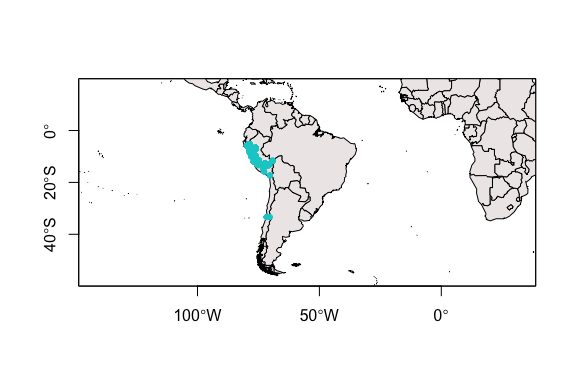

``` r
# Looks good; all points appear in their proper places 

# Drop the one instance of no lat/lon, which will cause problems for spatial data below
blood <- blood %>% filter(!is.na(lat)) # keep only records with lat 
blood <- blood %>% filter(!is.na(lon)) # keep only records with lon
# Note: this is a Phaethornis malaris observation with only Hct, so we don't lose much by dropping it

#write.csv(blood, "/Users/Jessie/Dropbox (MSBbirds)/Rdirectory/ComparativeHummingbirdBlood/blood.latlontest.csv")
```

Note about lat/lons: A bunch of lat/lons were missing from July 2007
Tres Lagunas, Lambayeque birds at 3,200 m. Chris said there was an error
in processing all of these birds, which are all problematic cases, so we
don’t have coords for them. However, one bird, NK162815 (C. iris) from
12 July 2007 does have coords for this locality, elev, and date range.
Chris and I decided to use the lat/lon for NK162815’s to fill in
coordinates for all missing-coord NKS.

I added coords from NK162815 to the following NKs: 162691, 162758,
162720, 162705, 162757, 162690, 162725, 162592, 162759, 162776, 162782,
162689, 162591, 162783, 162704

Subset the data by just values you’ll use in analysis
=====================================================

Previous code chunks made the dataset bloated and w/ many values you
don’t need; after comparing w/ raw Excel values, subset to have
something more manageable; also helps initiate removal of NAs, which is
prudent for modeling.

``` r
# The order that you write these in here is the order they'll appear in once subsetted
bsub <- subset(blood, select = c(rowID,
                                 nk,
                                 msb_cat_no, 
                                 prep_num,
                                 cat_owner,
                                 species,
                                 sex,
                                 age_est, # See notes in Excel metadata about estimating age from bursa; check w/ Chris
                               # day,
                                 month,
                                 year,
                                 locality,
                                 elev,
                                 department,
                               # provincia,
                               # distrito,
                                 lat,
                                 lon,
                                 mass_final,
                                 hb_final,
                               # hct_final,
                                 hct_final_percent,
                                 TRBC,
                                 MCV_final,
                                 MCHC_final,
                                 MCH_final
                                  ))
# Keep in mind minimizing the NAs in the dataset by only selecting things you'll need 
# Why does row 1189 keep ending up blank??

# Rename cumbersome variables to more workable names: 
colnames(bsub)
```

     [1] "rowID"             "nk"                "msb_cat_no"       
     [4] "prep_num"          "cat_owner"         "species"          
     [7] "sex"               "age_est"           "month"            
    [10] "year"              "locality"          "elev"             
    [13] "department"        "lat"               "lon"              
    [16] "mass_final"        "hb_final"          "hct_final_percent"
    [19] "TRBC"              "MCV_final"         "MCHC_final"       
    [22] "MCH_final"        

``` r
# library(plyr) # dplyr masked by functions in reshape and reshape 2
# So annoying: for some reason rename() in plyr won't work, so need to add this line by line
names(bsub)[names(bsub) == "age_est"] <- "age"
names(bsub)[names(bsub) == "mass_final"] <- "mass"
names(bsub)[names(bsub) == "hb_final"] <- "hb"
names(bsub)[names(bsub) == "hct_final"] <- "hct"
names(bsub)[names(bsub) == "hct_final_percent"] <- "hct_percent"
names(bsub)[names(bsub) == "MCV_final"] <- "mcv"
names(bsub)[names(bsub) == "MCHC_final"] <- "mchc"
names(bsub)[names(bsub) == "MCH_final"] <- "mch"

# bsub <- rename(bsub, c("mass_final"="mass", 
#                        "hb_final"="hb", 
#                        "hct_final"="hct",
#                        "hct_final_percent"="hct_percent",
#                        "MCV_final"="mcv", 
#                        "MCHC_final"="mchc", 
#                        "MCH_final"="mch")) 

# Instantiate column for wing chord length (mm); necessary for combining with Patagona and MSB wing loading data 
bsub$wing <- as.numeric(paste(""))
```

Note: NK219789 oddly has no locality or collection info associated w/
it. It does have some blood data, but this may end up being dropped
unless I can find other info (it doesn’t come up in a quick Arctos
search, so may require more digging).

Prep for merge w/ Patagona data
===============================

``` r
# Drop Patagona data in pdat that doesn't have any blood information associated with it
pdat$blood_data_YN <- as.factor(pdat$blood_data_YN)
pdat <- pdat[-which(pdat$blood_data_YN =="no"),] 
table(pdat$blood_data_YN) # Confirm that there are zero instances of "no" (should be 166 of "yes")
```


     no yes 
      0 166 

``` r
#test <- subset(pdat, (!is.na(pdat[,2]))) # This is a way to remove all NA vals from only column 2, but not sure I want this

# Split Patagona' museum_cat_num (in MSB:BIRD:xxxxx format) into three variables so you can extract just catalog number 
pdat <- separate(pdat, museum_cat_num, into=c("museum", "filler", "msb_cat_no"), sep = "[^[:alnum:]]+",
  remove = TRUE, # If TRUE, remove original "Identifier" column you split 
  convert = FALSE,
  extra = "warn",
  fill = "warn"
)

# subset pdat to include all the same columns that bsub has 
# subset pdat to prepare for merge w/ bsub
pdat <- subset(pdat, select = c(rowID,
                                 nk,
                                 msb_cat_no, # Any NA values are from uncatalogued birds 
                                 pers_cat_no,
                                 cat_owner,
                                 species,
                                 sex,
                                 age, 
                               # day, # did I not write "day" out to this file from Patagona_blood_analysis_2020?
                                 month,
                                 year,
                                 locality,
                                 elev,
                                 department,
                                 lat,
                                 lon,
                                 mass,
                                 hb,
                                 hct, # This is in percent
                                 TRBC,
                                 mcv,
                                 mchc,
                                 mch,
                                 wing
                                  ))

# Rename column headers to match bsub
names(pdat)[names(pdat) == "pers_cat_no"] <- "prep_num"
names(pdat)[names(pdat) == "hct"] <- "hct_percent"

# Set levels of pdat, aka change name of Patagona_gigas to Patagona gigas
pdat$species <- as.factor(pdat$species) # Make sure this is coded as a factor 
levels(pdat$species) # Verify level 
```

    [1] "Patagona_gigas"

``` r
levels(pdat$species) <- c("Patagona gigas")

# Now fill in cat_owner NAs with my name as the collector of blood data: 
pdat$cat_owner[is.na(pdat$cat_owner)] <- paste("Jessie L. Williamson") 

# Drop Patagona records from bsub - Patagona dataset is more stringently curated, so you want to replace Patagona
# data in bsub with Patagona data from pdat 
bsub <- bsub[-which(bsub$species =="Patagona gigas"),] 

# Compare column names of bsub and pdat to confirm order before merge 
colnames(pdat)
```

     [1] "rowID"       "nk"          "msb_cat_no"  "prep_num"    "cat_owner"  
     [6] "species"     "sex"         "age"         "month"       "year"       
    [11] "locality"    "elev"        "department"  "lat"         "lon"        
    [16] "mass"        "hb"          "hct_percent" "TRBC"        "mcv"        
    [21] "mchc"        "mch"         "wing"       

``` r
colnames(bsub)
```

     [1] "rowID"       "nk"          "msb_cat_no"  "prep_num"    "cat_owner"  
     [6] "species"     "sex"         "age"         "month"       "year"       
    [11] "locality"    "elev"        "department"  "lat"         "lon"        
    [16] "mass"        "hb"          "hct_percent" "TRBC"        "mcv"        
    [21] "mchc"        "mch"         "wing"       

Merge all hummingbird blood data w/ curated Patagona data
=========================================================

``` r
# Merge the two datasets together: marry the all hummingbird dataset minus Patagona WITH the full Patagona dataset 
# This includes Chilean Patagona and Peru Patagona collected by JLW 
full <- rbind(bsub, pdat) # Should be 1317 total rows 
# Keep in mind that many 'wing' measurements are zero at this point; this will be fixed once we combine w/ Skandalis & impute

# Now change name of "hct_percent" to "hct" to standardize
names(full)[names(full) == "hct_percent"] <- "hct"
names(full)[names(full) == "TRBC"] <- "trbc"

# Calculate number of species in the dataset:
length(unique(full$species)) # number of unique species
```

    [1] 77

``` r
# 77 total species 

# Write out "full" dataset for HumBlood_PreparatorContributions.rmd
#write.csv(full, "humblood_full.csv")
```

Transform some variables
========================

Predictor scatterplot matrix for outlier assessment
===================================================

Predictors/possible predictors for models for models
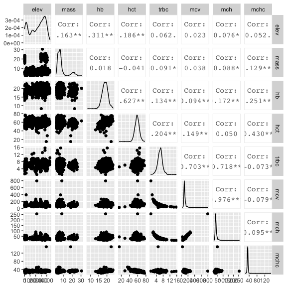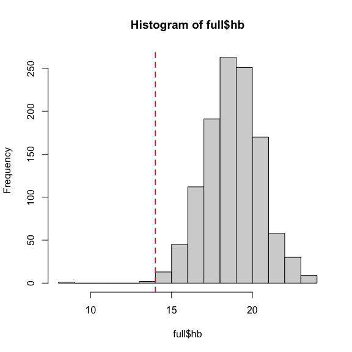

         rowID     nk msb_cat_no prep_num            cat_owner        species
    5710    57 279268       <NA> EBO 3089    Emil Bautista O.  Patagona gigas
    661     66 279289       <NA> EBO 3102    Emil Bautista O.  Patagona gigas
    1991   199 252159       <NA>     <NA> Jessie L. Williamson Patagona gigas
             sex      age    month year            locality elev        department
    5710  female    adult   August   42 Carretera_3N_km32.5 3672            Ancash
    661     male    adult   August   42            Huanchay 3006            Ancash
    1991 unknown juvenile February 2018           Algarrobo   10 Región Valparaíso
             lat     lon mass    hb      hct trbc      mcv    mchc    mch wing
    5710 -10.005 -77.130 20.0 13.05 42.40772 4.64 91.39594 30.7727 28.125  122
    661  -10.461 -77.407 22.8  8.20       NA   NA       NA      NA     NA  136
    1991 -33.348 -71.635 22.8 13.10       NA   NA       NA      NA     NA  117

     [1] rowID      nk         msb_cat_no prep_num   cat_owner  species   
     [7] sex        age        month      year       locality   elev      
    [13] department lat        lon        mass       hb         hct       
    [19] trbc       mcv        mchc       mch        wing      
    <0 rows> (or 0-length row.names)

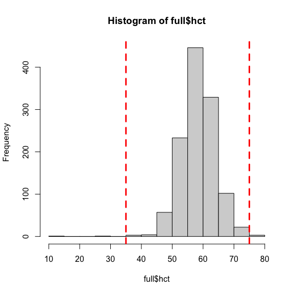

         rowID     nk msb_cat_no prep_num         cat_owner        species    sex
    1910    19 168572      33353 EBO 1386 Emil Bautista O.  Patagona gigas   male
    2110    21 168709      33490 EBO 1524 Emil Bautista O.  Patagona gigas female
              age     month year                  locality elev department
    1910 juvenile September   38 San_Pedro_de_Casta_Potago 3905       Lima
    2110 juvenile   October   38 San_Pedro_de_Casta_Potago 4082       Lima
               lat       lon mass   hb      hct trbc      mcv      mchc      mch
    1910 -11.76770 -76.53462 18.4 22.6 14.97660 5.06 29.59802 150.90208 44.66403
    2110 -11.76847 -76.53325 18.5 19.4 28.69469 6.04 47.50777  33.80416 32.11921
         wing
    1910  137
    2110  137

        rowID     nk msb_cat_no prep_num           cat_owner
    49     49 161012      27245 ABJ 1712   Andrew B. Johnson
    447   447 163390      31718  EBO 787    Emil Bautista O.
    670   670 168900      33674  MJL 401 Michael J. Lelevier
                           species    sex   age    month year
    49          Schistes geoffroyi   male adult    March 2007
    447 Oreotrochilus melanogaster female adult      May 2008
    670          Amazilia amazilia   male adult December 2009
                      locality elev department       lat       lon mass   hb
    49                SanPedro 1395      Cuzco -13.05550 -71.54667 4.09 23.0
    447            Carhuayumac 3750       Lima -11.76188 -76.54887 7.85   NA
    670 ca. 9.8 km N. of Olmos  129 Lambayeque  -5.89136 -79.78718 4.43 16.5
             hct trbc      mcv     mchc      mch wing
    49  75.20000 5.91 127.2420 30.58511 38.91709   NA
    447 76.15817   NA       NA       NA       NA   NA
    670 76.91014 5.80 132.6037 21.45361 28.44828   NA

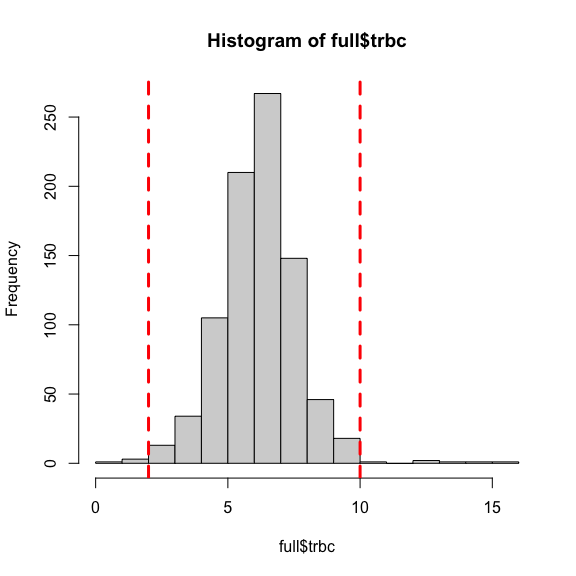

         rowID     nk msb_cat_no prep_num              cat_owner
    522    522 167714      32542  JNZ 758 Jano Alex Nunez Zapata
    527    527 167853      32681 ABJ 2164      Andrew B. Johnson
    974    974 176294      37114 PMB 1500        Phred M. Benham
    1185  1186 279004       <NA>  SMB 503  Selina M. Bauernfeind
                           species    sex      age    month year  locality elev
    522       Heliodoxa rubinoides female    adult     July 2008  Tullanya 2200
    527  Phaethornis syrmatophorus female juvenile     July 2008  Tullanya 2031
    974           Glaucis hirsutus   male    adult     June 2011    Alerta  290
    1185   Sephanoides sephaniodes   male juvenile December 2018 Algarrobo   10
            department        lat       lon mass   hb      hct trbc      mcv
    522       Amazonas  -6.099083 -78.34277 8.41 19.2 59.62993 0.75 795.0657
    527       Amazonas  -6.109700 -78.34158 5.67 16.5 53.63300 1.99 269.5126
    974  Madre de Dios -11.710300 -69.21115 6.93   NA 60.80560 1.55 392.2942
    1185    Valparaíso -33.348600 -71.63690 5.70   NA       NA 1.17       NA
             mchc       mch wing
    522  32.19860 256.00000   NA
    527  30.76464  82.91457   NA
    974        NA        NA   NA
    1185       NA        NA   NA

        rowID     nk msb_cat_no prep_num           cat_owner
    337   337 162788      28218  EBO 473    Emil Bautista O.
    680   680 169123      33897  MJL 460 Michael J. Lelevier
    681   681 169124      33898  PMB 945     Phred M. Benham
    726   726 169373      34147 EBO 1646    Emil Bautista O.
    896   896 173953      36122  MRJ 238    Matthew R. Jones
    916   916 175375      36444  MRJ 325    Matthew R. Jones
                        species    sex   age    month year       locality elev
    337   Metallura tyrianthina   male adult     July 2007   Tres Lagunas 3219
    680   Metallura tyrianthina   male adult December 2009         Ccocha 3688
    681      Coeligena violifer   male adult December 2009         Ccocha 3688
    726 Aglaeactis castelnaudii female adult  January 2010 Laguna Anantay 4578
    896    Ocreatus underwoodii   male adult     June 2011     Plataforma 1683
    916     Heliodoxa aurescens female adult     June 2011     Plataforma 1343
        department        lat       lon  mass   hb      hct  trbc      mcv     mchc
    337 Lambayeque  -6.244333 -79.24667 4.000 18.7 63.77220 13.07 48.79280 29.32312
    680   Apurimac -13.487100 -72.98202 3.430 17.9 58.73984 14.32 41.01944 30.47336
    681   Apurimac -13.487100 -72.98202 7.012 20.2 64.75114 15.67 41.32172 31.19636
    726   Apurimac -14.068767 -73.01717 5.950 19.6 60.74194 10.13 59.96243 32.26765
    896 San Martin  -7.419150 -76.29115 2.700   NA 61.98251 12.69 48.84358       NA
    916 San Martin  -7.411300 -76.27625 5.680   NA 63.34297 12.16 52.09126       NA
             mch wing
    337 14.30757   NA
    680 12.50000   NA
    681 12.89087   NA
    726 19.34847   NA
    896       NA   NA
    916       NA   NA

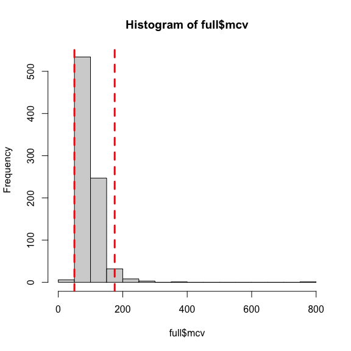

         rowID     nk msb_cat_no prep_num           cat_owner               species
    337    337 162788      28218  EBO 473    Emil Bautista O. Metallura tyrianthina
    680    680 169123      33897  MJL 460 Michael J. Lelevier Metallura tyrianthina
    681    681 169124      33898  PMB 945     Phred M. Benham    Coeligena violifer
    896    896 173953      36122  MRJ 238    Matthew R. Jones  Ocreatus underwoodii
    1910    19 168572      33353 EBO 1386   Emil Bautista O.         Patagona gigas
    2110    21 168709      33490 EBO 1524   Emil Bautista O.         Patagona gigas
            sex      age     month year                  locality elev department
    337    male    adult      July 2007              Tres Lagunas 3219 Lambayeque
    680    male    adult  December 2009                    Ccocha 3688   Apurimac
    681    male    adult  December 2009                    Ccocha 3688   Apurimac
    896    male    adult      June 2011                Plataforma 1683 San Martin
    1910   male juvenile September   38 San_Pedro_de_Casta_Potago 3905       Lima
    2110 female juvenile   October   38 San_Pedro_de_Casta_Potago 4082       Lima
                lat       lon   mass   hb      hct  trbc      mcv      mchc
    337   -6.244333 -79.24667  4.000 18.7 63.77220 13.07 48.79280  29.32312
    680  -13.487100 -72.98202  3.430 17.9 58.73984 14.32 41.01944  30.47336
    681  -13.487100 -72.98202  7.012 20.2 64.75114 15.67 41.32172  31.19636
    896   -7.419150 -76.29115  2.700   NA 61.98251 12.69 48.84358        NA
    1910 -11.767700 -76.53462 18.400 22.6 14.97660  5.06 29.59802 150.90208
    2110 -11.768467 -76.53325 18.500 19.4 28.69469  6.04 47.50777  33.80416
              mch wing
    337  14.30757   NA
    680  12.50000   NA
    681  12.89087   NA
    896        NA   NA
    1910 44.66403  137
    2110 32.11921  137

         rowID     nk msb_cat_no prep_num              cat_owner
    259    259 162528      31309  DSC 708      Dora Susanibar C.
    505    505 163895      32223 DCS 6025       Donna C. Schmitt
    508    508 163914      32242 DFL 2393         Daniel F. Lane
    509    509 163915      32243 DFL 2396         Daniel F. Lane
    511    511 167516      32344  RJD 112       Robert J. Driver
    514    514 167564      32392 ABJ 2135      Andrew B. Johnson
    517    517 167644      32472 ABJ 2147      Andrew B. Johnson
    518    518 167651      32479 DCS 6100       Donna C. Schmitt
    522    522 167714      32542  JNZ 758 Jano Alex Nunez Zapata
    525    525 167798      32626 DCS 6140       Donna C. Schmitt
    527    527 167853      32681 ABJ 2164      Andrew B. Johnson
    530    530 167867      32695  RJD 140       Robert J. Driver
    532    532 167874      32702 DFL 2419         Daniel F. Lane
    534    534 167879      32707 DCS 6158       Donna C. Schmitt
    535    535 167880      32708 DCS 6159       Donna C. Schmitt
    536    536 167994      32822 DCS 6177       Donna C. Schmitt
    537    537 168012      32840  AQZ 202    Alessandra Quinonez
    538    538 168015      32843  WAT 199      William A. Talbot
    539    539 168042      32870 ABJ 2172      Andrew B. Johnson
    540    540 168052      32880  EBO 929       Emil Bautista O.
    541    541 168056      32884  AQZ 204    Alessandra Quinonez
    595    595 168416      33197 EBO 1213       Emil Bautista O.
    617    617 168510      33291 EBO 1324       Emil Bautista O.
    624    624 168530      33311 EBO 1339       Emil Bautista O.
    626    626 168532      33313 EBO 1346       Emil Bautista O.
    636    636 168600      33381 EBO 1414       Emil Bautista O.
    639    639 168608      33389 EBO 1422       Emil Bautista O.
    640    640 168609      33390 EBO 1423       Emil Bautista O.
    647    647 168630      33411 EBO 1444       Emil Bautista O.
    733    733 171080      34354 DCS 6967       Donna C. Schmitt
    734    734 171094      34368 DCS 6972       Donna C. Schmitt
    736    736 171099      34373  CJS 459    C. Jonathan Schmitt
    737    737 171100      34374 DCS 6976       Donna C. Schmitt
    738    738 171104      34378 DCS 6977       Donna C. Schmitt
    743    743 171133      34407 DCS 6994       Donna C. Schmitt
    945    945 176006      36826  EJB 153   Elizabeth J. Beckman
    974    974 176294      37114 PMB 1500        Phred M. Benham
    991    991 176420      37240 ABJ 2862      Andrew B. Johnson
    1109  1110 220246      31024 CCW 1042    Christopher C. Witt
    1187  1188 279035       <NA>  SMB 524  Selina M. Bauernfeind
    1188  1189 279047       <NA>  JLW 062   Jessie L. Williamson
    3210    32 279226       <NA> EBO 3063      Emil Bautista O. 
    3310    33 279227       <NA> EBO 3064      Emil Bautista O. 
    391     39 279236       <NA> EBO 3069      Emil Bautista O. 
    6110    61 279278       <NA> EBO 3095      Emil Bautista O. 
                             species    sex      age     month year       locality
    259          Phaethornis malaris female    adult      June 2007        Sianbal
    505          Coeligena coeligena   male    adult      July 2008       Tullanya
    508          Coeligena coeligena female    adult      July 2008       Tullanya
    509          Coeligena coeligena female    adult      July 2008       Tullanya
    511          Coeligena coeligena   male    adult      July 2008       Tullanya
    514        Adelomyia melanogenys   male    adult      July 2008       Tullanya
    517          Coeligena coeligena female juvenile      July 2008       Tullanya
    518           Doryfera ludovicae female    adult      July 2008       Tullanya
    522         Heliodoxa rubinoides female    adult      July 2008       Tullanya
    525           Doryfera ludovicae female    adult      July 2008       Tullanya
    527    Phaethornis syrmatophorus female juvenile      July 2008       Tullanya
    530           Doryfera ludovicae female    adult      July 2008       Tullanya
    532          Colibri thalassinus   male    adult      July 2008       Tullanya
    534      Boissonneaua matthewsii   male juvenile      July 2008       Tullanya
    535      Boissonneaua matthewsii female juvenile      July 2008       Tullanya
    536        Heliodoxa leadbeateri female    adult      July 2008       Tullanya
    537        Adelomyia melanogenys   male juvenile      July 2008       Tullanya
    538           Coeligena torquata female    adult      July 2008       Tullanya
    539         Ocreatus underwoodii female    adult      July 2008       Tullanya
    540    Phaethornis syrmatophorus female juvenile      July 2008       Tullanya
    541    Phaethornis syrmatophorus   male juvenile      July 2008       Tullanya
    595           Coeligena violifer   male    adult     March 2009 Quebrada Honda
    617   Oreotrochilus melanogaster female    adult September 2009         Potaga
    624   Oreotrochilus melanogaster female juvenile September 2009         Potaga
    626   Oreotrochilus melanogaster female    adult September 2009         Potaga
    636   Oreotrochilus melanogaster   male  unknown September 2009         Potaga
    639             Metallura phoebe   male    adult September 2009         Potaga
    640            Colibri coruscans   male    adult September 2009         Potaga
    647             Metallura phoebe   male juvenile September 2009         Potaga
    733              Phaethornis guy   male    adult      June 2010       Quebrada
    734        Chalcostigma ruficeps female    adult      June 2010 Quebrada Honda
    736        Chalcostigma ruficeps female    adult      June 2010 Quebrada Honda
    737           Coeligena violifer   male    adult      June 2010 Quebrada Honda
    738  Heliangelus amethysticollis female    adult      June 2010 Quebrada Honda
    743           Coeligena violifer   male    adult      June 2010 Quebrada Honda
    945           Schistes geoffroyi   male    adult      June 2011         Cadena
    974             Glaucis hirsutus   male    adult      June 2011         Alerta
    991          Florisuga mellivora female    adult      July 2011         Alerta
    1109           Colibri coruscans   male    adult      July 2006            SE2
    1187     Sephanoides sephaniodes   male juvenile  December 2018      Algarrobo
    1188     Sephanoides sephaniodes   male juvenile  December 2018      Algarrobo
    3210              Patagona gigas female    adult    August   42       Atogolpo
    3310              Patagona gigas   male    adult    August   42       Atogolpo
    391               Patagona gigas female    adult    August   42       Atogolpo
    6110              Patagona gigas female    adult    August   42          Oncoy
         elev    department        lat       lon  mass   hb      hct trbc      mcv
    259   352    San Martin  -6.650767 -76.07918  5.60 20.5 65.44635 3.57 183.3231
    505  2181      Amazonas  -6.101500 -78.34428  8.40 19.5 63.46597 3.50 181.3314
    508  2131      Amazonas  -6.103833 -78.34358  6.15 18.1 54.57766 3.55 153.7399
    509  2100      Amazonas  -6.100000 -78.33333  5.38 17.6 55.21874 3.46 159.5917
    511  2052      Amazonas  -6.104500 -78.34158  6.85 19.8 63.47962 3.34 190.0588
    514  2031      Amazonas  -6.109700 -78.34158  4.10 19.2 58.60377 3.06 191.5156
    517  2100      Amazonas  -6.101650 -78.34288  5.92 16.1 48.60380 2.71 179.3498
    518  2131      Amazonas  -6.103750 -78.34358  5.50 20.7 65.58458 3.76 174.4271
    522  2200      Amazonas  -6.099083 -78.34277  8.41 19.2 59.62993 0.75 795.0657
    525  2015      Amazonas  -6.098917 -78.33827  6.16 19.7 58.62983 3.42 171.4322
    527  2031      Amazonas  -6.109700 -78.34158  5.67 16.5 53.63300 1.99 269.5126
    530  2031      Amazonas  -6.100600 -78.33947  5.99 19.7 57.29697 2.19 261.6300
    532  1890      Amazonas  -6.117600 -78.34218  5.12 18.1 55.50864 2.74 202.5863
    534  2076      Amazonas  -6.099517 -78.33923  8.09 17.8 51.39585 2.33 220.5830
    535  2076      Amazonas  -6.099517 -78.33923  7.25 17.0 50.18778 3.18 157.8232
    536  1890      Amazonas  -6.117600 -78.34218  8.86 18.1 57.46672 3.06 187.7997
    537  2015      Amazonas  -6.098917 -78.33827  4.21 19.3 60.41162 2.52 239.7287
    538  2884      Amazonas  -6.074333 -78.32353  8.05 20.6 67.71888 2.90 233.5134
    539  2131      Amazonas  -6.103750 -78.34358  2.85 20.0 61.34650 3.66 167.6134
    540  2085      Amazonas  -6.099750 -78.33925  4.86 18.1 56.92155 3.42 166.4373
    541  2085      Amazonas  -6.099750 -78.33925  4.77 21.1 65.11091 3.50 186.0312
    595  2858         Cuzco -12.621417 -72.24210  7.53 22.6 65.93663 4.16 158.5015
    617  3932          Lima -11.764183 -76.54300  7.46 20.7 66.40811 3.45 192.4873
    624  4056          Lima -11.767700 -76.53462  6.40   NA 58.58974 2.90 202.0336
    626  4056          Lima -11.767700 -76.53462  6.40 23.6 63.05125 4.10 153.7835
    636  4150          Lima -11.769583 -76.53193  8.40 21.7 62.99283 4.01 157.0894
    639  3908          Lima -11.767700 -76.53462  7.00 20.4 57.86385 3.20 180.8245
    640  3907          Lima -11.767700 -76.53462 10.30 21.3 56.51895 3.34 169.2184
    647  3974          Lima -11.767700 -76.53462  7.50 18.9 54.51128 3.50 155.7465
    733  1500         Cuzco -12.651900 -72.32360  5.00 18.5 70.02012 4.43 158.0590
    734  2850         Cuzco -12.621050 -72.24240  4.00 19.2 62.81646 3.52 178.4558
    736  2850         Cuzco -12.621050 -72.24240  3.45 17.7 61.71533 2.89 213.5478
    737  2850         Cuzco -12.621050 -72.24240  8.87 18.1 58.92624 2.21 266.6346
    738  2850         Cuzco -12.621050 -72.24240  4.84 18.2 58.31584 2.79 209.0174
    743  2850         Cuzco -12.621050 -72.24240  7.51 19.7 62.52148 4.14 151.0181
    945  1172         Cuzco -13.349633 -70.86185  3.60   NA 70.97242 4.13 171.8461
    974   290 Madre de Dios -11.710300 -69.21115  6.93   NA 60.80560 1.55 392.2942
    991   290 Madre de Dios -11.710300 -69.21115  6.58   NA 57.79851 3.53 163.7351
    1109 3040          Lima -11.758317 -76.58463  8.40 19.8 57.86646 2.90 199.5395
    1187   10    Valparaíso -33.348600 -71.63690  6.10 15.9 51.53374 3.42 150.6835
    1188   10    Valparaíso -33.348600 -71.63690  5.70 16.3 48.70000 2.74 177.7372
    3210 3707          Lima -11.772000 -76.57300 20.00 22.8 68.44538 3.87 176.8614
    3310 3707          Lima -11.772000 -76.57300 25.50 22.1 58.83002 3.56 165.2529
    391  3707          Lima -11.772000 -76.57300 18.30 21.3 62.82987 4.09 153.6183
    6110 3796        Ancash -10.341000 -77.35500 22.10 18.6 56.58763 2.76 205.0276
             mchc       mch wing
    259  31.32336  57.42297   NA
    505  30.72512  55.71429   NA
    508  33.16375  50.98592   NA
    509  31.87324  50.86705   NA
    511  31.19111  59.28144   NA
    514  32.76240  62.74510   NA
    517  33.12498  59.40959   NA
    518  31.56230  55.05319   NA
    522  32.19860 256.00000   NA
    525  33.60065  57.60234   NA
    527  30.76464  82.91457   NA
    530  34.38227  89.95434   NA
    532  32.60753  66.05839   NA
    534  34.63315  76.39485   NA
    535  33.87279  53.45912   NA
    536  31.49649  59.15033   NA
    537  31.94749  76.58730   NA
    538  30.41988  71.03448   NA
    539  32.60170  54.64481   NA
    540  31.79815  52.92398   NA
    541  32.40625  60.28571   NA
    595  34.27534  54.32692   NA
    617  31.17089  60.00000   NA
    624        NA        NA   NA
    626  37.42987  57.56098   NA
    636  34.44836  54.11471   NA
    639  35.25517  63.75000   NA
    640  37.68648  63.77246   NA
    647  34.67172  54.00000   NA
    733  26.42098  41.76072   NA
    734  30.56524  54.54545   NA
    736  28.68007  61.24567   NA
    737  30.71636  81.90045   NA
    738  31.20936  65.23297   NA
    743  31.50917  47.58454   NA
    945        NA        NA   NA
    974        NA        NA   NA
    991        NA        NA   NA
    1109 34.21671  68.27586   NA
    1187 30.85357  46.49123   NA
    1188 33.47023  59.48905   NA
    3210 33.31123  58.91473   NA
    3310 37.56585  62.07865   NA
    391  33.90107  52.07824  115
    6110 32.86938  67.39130  136

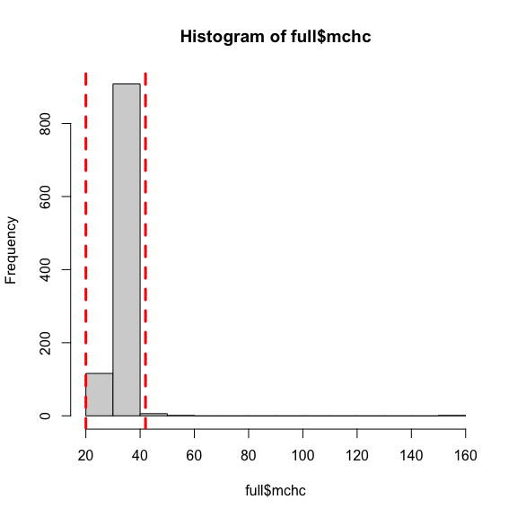

     [1] rowID      nk         msb_cat_no prep_num   cat_owner  species   
     [7] sex        age        month      year       locality   elev      
    [13] department lat        lon        mass       hb         hct       
    [19] trbc       mcv        mchc       mch        wing      
    <0 rows> (or 0-length row.names)

         rowID     nk msb_cat_no prep_num            cat_owner              species
    1065  1065 218922      42294  SGD 533       Shane G. DuBay  Coeligena coeligena
    1078  1078 218967      42339  SGD 543       Shane G. DuBay Ocreatus underwoodii
    1093  1093 219391      42453  EJB 354 Elizabeth J. Beckman  Colibri thalassinus
    1910    19 168572      33353 EBO 1386    Emil Bautista O.        Patagona gigas
            sex      age     month year                  locality elev department
    1065 female    adult      June 2012                 Las Pinas 2142   Amazonas
    1078   male    adult      June 2012                 Las Pinas 2200   Amazonas
    1093   male    adult      July 2012                  Chontali 2512  Cajamarca
    1910   male juvenile September   38 San_Pedro_de_Casta_Potago 3905       Lima
                lat       lon  mass   hb      hct trbc      mcv      mchc      mch
    1065  -6.049133 -78.22678  6.41 19.5 39.09091   NA       NA  49.88372       NA
    1078  -6.047667 -78.22873  2.84 16.0 37.90323   NA       NA  42.21277       NA
    1093  -5.585183 -79.15823  4.92 18.3 35.29957   NA       NA  51.84199       NA
    1910 -11.767700 -76.53462 18.40 22.6 14.97660 5.06 29.59802 150.90208 44.66403
         wing
    1065   NA
    1078   NA
    1093   NA
    1910  137

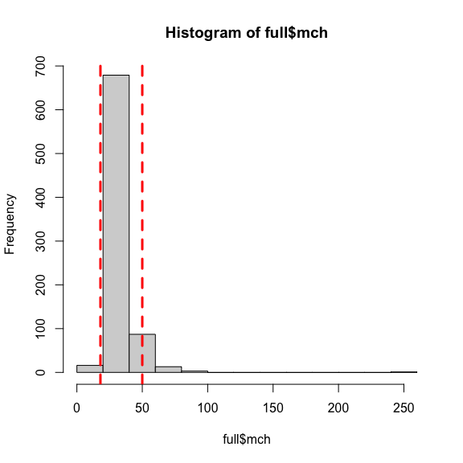

        rowID     nk msb_cat_no prep_num           cat_owner               species
    337   337 162788      28218  EBO 473    Emil Bautista O. Metallura tyrianthina
    680   680 169123      33897  MJL 460 Michael J. Lelevier Metallura tyrianthina
    681   681 169124      33898  PMB 945     Phred M. Benham    Coeligena violifer
         sex   age    month year     locality elev department        lat       lon
    337 male adult     July 2007 Tres Lagunas 3219 Lambayeque  -6.244333 -79.24667
    680 male adult December 2009       Ccocha 3688   Apurimac -13.487100 -72.98202
    681 male adult December 2009       Ccocha 3688   Apurimac -13.487100 -72.98202
         mass   hb      hct  trbc      mcv     mchc      mch wing
    337 4.000 18.7 63.77220 13.07 48.79280 29.32312 14.30757   NA
    680 3.430 17.9 58.73984 14.32 41.01944 30.47336 12.50000   NA
    681 7.012 20.2 64.75114 15.67 41.32172 31.19636 12.89087   NA

         rowID     nk msb_cat_no prep_num              cat_owner
    259    259 162528      31309  DSC 708      Dora Susanibar C.
    406    406 163091      31527  EBO 644       Emil Bautista O.
    505    505 163895      32223 DCS 6025       Donna C. Schmitt
    508    508 163914      32242 DFL 2393         Daniel F. Lane
    509    509 163915      32243 DFL 2396         Daniel F. Lane
    511    511 167516      32344  RJD 112       Robert J. Driver
    514    514 167564      32392 ABJ 2135      Andrew B. Johnson
    517    517 167644      32472 ABJ 2147      Andrew B. Johnson
    518    518 167651      32479 DCS 6100       Donna C. Schmitt
    522    522 167714      32542  JNZ 758 Jano Alex Nunez Zapata
    525    525 167798      32626 DCS 6140       Donna C. Schmitt
    527    527 167853      32681 ABJ 2164      Andrew B. Johnson
    530    530 167867      32695  RJD 140       Robert J. Driver
    532    532 167874      32702 DFL 2419         Daniel F. Lane
    534    534 167879      32707 DCS 6158       Donna C. Schmitt
    535    535 167880      32708 DCS 6159       Donna C. Schmitt
    536    536 167994      32822 DCS 6177       Donna C. Schmitt
    537    537 168012      32840  AQZ 202    Alessandra Quinonez
    538    538 168015      32843  WAT 199      William A. Talbot
    539    539 168042      32870 ABJ 2172      Andrew B. Johnson
    540    540 168052      32880  EBO 929       Emil Bautista O.
    541    541 168056      32884  AQZ 204    Alessandra Quinonez
    595    595 168416      33197 EBO 1213       Emil Bautista O.
    609    609 168489      33270 EBO 1269       Emil Bautista O.
    617    617 168510      33291 EBO 1324       Emil Bautista O.
    626    626 168532      33313 EBO 1346       Emil Bautista O.
    636    636 168600      33381 EBO 1414       Emil Bautista O.
    639    639 168608      33389 EBO 1422       Emil Bautista O.
    640    640 168609      33390 EBO 1423       Emil Bautista O.
    647    647 168630      33411 EBO 1444       Emil Bautista O.
    734    734 171094      34368 DCS 6972       Donna C. Schmitt
    736    736 171099      34373  CJS 459    C. Jonathan Schmitt
    737    737 171100      34374 DCS 6976       Donna C. Schmitt
    738    738 171104      34378 DCS 6977       Donna C. Schmitt
    879    879 173835      36004 EBO 2014       Emil Bautista O.
    1109  1110 220246      31024 CCW 1042    Christopher C. Witt
    1153  1154 220382      31160    CCW ?    Christopher C. Witt
    1188  1189 279047       <NA>  JLW 062   Jessie L. Williamson
    3210    32 279226       <NA> EBO 3063      Emil Bautista O. 
    3310    33 279227       <NA> EBO 3064      Emil Bautista O. 
    3610    36 279232       <NA> EBO 3067      Emil Bautista O. 
    391     39 279236       <NA> EBO 3069      Emil Bautista O. 
    6110    61 279278       <NA> EBO 3095      Emil Bautista O. 
                             species    sex      age     month year       locality
    259          Phaethornis malaris female    adult      June 2007        Sianbal
    406             Metallura phoebe female    adult   January 2008      Carampoma
    505          Coeligena coeligena   male    adult      July 2008       Tullanya
    508          Coeligena coeligena female    adult      July 2008       Tullanya
    509          Coeligena coeligena female    adult      July 2008       Tullanya
    511          Coeligena coeligena   male    adult      July 2008       Tullanya
    514        Adelomyia melanogenys   male    adult      July 2008       Tullanya
    517          Coeligena coeligena female juvenile      July 2008       Tullanya
    518           Doryfera ludovicae female    adult      July 2008       Tullanya
    522         Heliodoxa rubinoides female    adult      July 2008       Tullanya
    525           Doryfera ludovicae female    adult      July 2008       Tullanya
    527    Phaethornis syrmatophorus female juvenile      July 2008       Tullanya
    530           Doryfera ludovicae female    adult      July 2008       Tullanya
    532          Colibri thalassinus   male    adult      July 2008       Tullanya
    534      Boissonneaua matthewsii   male juvenile      July 2008       Tullanya
    535      Boissonneaua matthewsii female juvenile      July 2008       Tullanya
    536        Heliodoxa leadbeateri female    adult      July 2008       Tullanya
    537        Adelomyia melanogenys   male juvenile      July 2008       Tullanya
    538           Coeligena torquata female    adult      July 2008       Tullanya
    539         Ocreatus underwoodii female    adult      July 2008       Tullanya
    540    Phaethornis syrmatophorus female juvenile      July 2008       Tullanya
    541    Phaethornis syrmatophorus   male juvenile      July 2008       Tullanya
    595           Coeligena violifer   male    adult     March 2009 Quebrada Honda
    609         Amazilia viridicauda   male juvenile     April 2009      Calca Rio
    617   Oreotrochilus melanogaster female    adult September 2009         Potaga
    626   Oreotrochilus melanogaster female    adult September 2009         Potaga
    636   Oreotrochilus melanogaster   male  unknown September 2009         Potaga
    639             Metallura phoebe   male    adult September 2009         Potaga
    640            Colibri coruscans   male    adult September 2009         Potaga
    647             Metallura phoebe   male juvenile September 2009         Potaga
    734        Chalcostigma ruficeps female    adult      June 2010 Quebrada Honda
    736        Chalcostigma ruficeps female    adult      June 2010 Quebrada Honda
    737           Coeligena violifer   male    adult      June 2010 Quebrada Honda
    738  Heliangelus amethysticollis female    adult      June 2010 Quebrada Honda
    879             Metallura phoebe female    adult       May 2011         Macate
    1109           Colibri coruscans   male    adult      July 2006            SE2
    1153          Coeligena torquata   male    adult    August 2006      Calabaza1
    1188     Sephanoides sephaniodes   male juvenile  December 2018      Algarrobo
    3210              Patagona gigas female    adult    August   42       Atogolpo
    3310              Patagona gigas   male    adult    August   42       Atogolpo
    3610              Patagona gigas female    adult    August   42       Atogolpo
    391               Patagona gigas female    adult    August   42       Atogolpo
    6110              Patagona gigas female    adult    August   42          Oncoy
         elev department        lat       lon  mass   hb      hct trbc      mcv
    259   352 San Martin  -6.650767 -76.07918  5.60 20.5 65.44635 3.57 183.3231
    406  3981       Lima -11.627783 -76.43412  5.19 20.3       NA 3.99       NA
    505  2181   Amazonas  -6.101500 -78.34428  8.40 19.5 63.46597 3.50 181.3314
    508  2131   Amazonas  -6.103833 -78.34358  6.15 18.1 54.57766 3.55 153.7399
    509  2100   Amazonas  -6.100000 -78.33333  5.38 17.6 55.21874 3.46 159.5917
    511  2052   Amazonas  -6.104500 -78.34158  6.85 19.8 63.47962 3.34 190.0588
    514  2031   Amazonas  -6.109700 -78.34158  4.10 19.2 58.60377 3.06 191.5156
    517  2100   Amazonas  -6.101650 -78.34288  5.92 16.1 48.60380 2.71 179.3498
    518  2131   Amazonas  -6.103750 -78.34358  5.50 20.7 65.58458 3.76 174.4271
    522  2200   Amazonas  -6.099083 -78.34277  8.41 19.2 59.62993 0.75 795.0657
    525  2015   Amazonas  -6.098917 -78.33827  6.16 19.7 58.62983 3.42 171.4322
    527  2031   Amazonas  -6.109700 -78.34158  5.67 16.5 53.63300 1.99 269.5126
    530  2031   Amazonas  -6.100600 -78.33947  5.99 19.7 57.29697 2.19 261.6300
    532  1890   Amazonas  -6.117600 -78.34218  5.12 18.1 55.50864 2.74 202.5863
    534  2076   Amazonas  -6.099517 -78.33923  8.09 17.8 51.39585 2.33 220.5830
    535  2076   Amazonas  -6.099517 -78.33923  7.25 17.0 50.18778 3.18 157.8232
    536  1890   Amazonas  -6.117600 -78.34218  8.86 18.1 57.46672 3.06 187.7997
    537  2015   Amazonas  -6.098917 -78.33827  4.21 19.3 60.41162 2.52 239.7287
    538  2884   Amazonas  -6.074333 -78.32353  8.05 20.6 67.71888 2.90 233.5134
    539  2131   Amazonas  -6.103750 -78.34358  2.85 20.0 61.34650 3.66 167.6134
    540  2085   Amazonas  -6.099750 -78.33925  4.86 18.1 56.92155 3.42 166.4373
    541  2085   Amazonas  -6.099750 -78.33925  4.77 21.1 65.11091 3.50 186.0312
    595  2858      Cuzco -12.621417 -72.24210  7.53 22.6 65.93663 4.16 158.5015
    609  2953      Cuzco -13.325900 -71.95682  5.61 22.8 60.07151 4.02 149.4316
    617  3932       Lima -11.764183 -76.54300  7.46 20.7 66.40811 3.45 192.4873
    626  4056       Lima -11.767700 -76.53462  6.40 23.6 63.05125 4.10 153.7835
    636  4150       Lima -11.769583 -76.53193  8.40 21.7 62.99283 4.01 157.0894
    639  3908       Lima -11.767700 -76.53462  7.00 20.4 57.86385 3.20 180.8245
    640  3907       Lima -11.767700 -76.53462 10.30 21.3 56.51895 3.34 169.2184
    647  3974       Lima -11.767700 -76.53462  7.50 18.9 54.51128 3.50 155.7465
    734  2850      Cuzco -12.621050 -72.24240  4.00 19.2 62.81646 3.52 178.4558
    736  2850      Cuzco -12.621050 -72.24240  3.45 17.7 61.71533 2.89 213.5478
    737  2850      Cuzco -12.621050 -72.24240  8.87 18.1 58.92624 2.21 266.6346
    738  2850      Cuzco -12.621050 -72.24240  4.84 18.2 58.31584 2.79 209.0174
    879  3900     Ancash  -8.752360 -78.03402  5.05 19.3       NA 3.58       NA
    1109 3040       Lima -11.758317 -76.58463  8.40 19.8 57.86646 2.90 199.5395
    1153 2440      Junin -11.510783 -74.84242  7.60 22.0 62.86895 4.29 146.5477
    1188   10 Valparaíso -33.348600 -71.63690  5.70 16.3 48.70000 2.74 177.7372
    3210 3707       Lima -11.772000 -76.57300 20.00 22.8 68.44538 3.87 176.8614
    3310 3707       Lima -11.772000 -76.57300 25.50 22.1 58.83002 3.56 165.2529
    3610 3707       Lima -11.772000 -76.57300 20.00 19.9 52.51214 3.58 146.6820
    391  3707       Lima -11.772000 -76.57300 18.30 21.3 62.82987 4.09 153.6183
    6110 3796     Ancash -10.341000 -77.35500 22.10 18.6 56.58763 2.76 205.0276
             mchc       mch wing
    259  31.32336  57.42297   NA
    406        NA  50.87719   NA
    505  30.72512  55.71429   NA
    508  33.16375  50.98592   NA
    509  31.87324  50.86705   NA
    511  31.19111  59.28144   NA
    514  32.76240  62.74510   NA
    517  33.12498  59.40959   NA
    518  31.56230  55.05319   NA
    522  32.19860 256.00000   NA
    525  33.60065  57.60234   NA
    527  30.76464  82.91457   NA
    530  34.38227  89.95434   NA
    532  32.60753  66.05839   NA
    534  34.63315  76.39485   NA
    535  33.87279  53.45912   NA
    536  31.49649  59.15033   NA
    537  31.94749  76.58730   NA
    538  30.41988  71.03448   NA
    539  32.60170  54.64481   NA
    540  31.79815  52.92398   NA
    541  32.40625  60.28571   NA
    595  34.27534  54.32692   NA
    609  37.95476  56.71642   NA
    617  31.17089  60.00000   NA
    626  37.42987  57.56098   NA
    636  34.44836  54.11471   NA
    639  35.25517  63.75000   NA
    640  37.68648  63.77246   NA
    647  34.67172  54.00000   NA
    734  30.56524  54.54545   NA
    736  28.68007  61.24567   NA
    737  30.71636  81.90045   NA
    738  31.20936  65.23297   NA
    879        NA  53.91061   NA
    1109 34.21671  68.27586   NA
    1153 34.99343  51.28205   NA
    1188 33.47023  59.48905   NA
    3210 33.31123  58.91473   NA
    3310 37.56585  62.07865   NA
    3610 37.89600  55.58659  125
    391  33.90107  52.07824  115
    6110 32.86938  67.39130  136

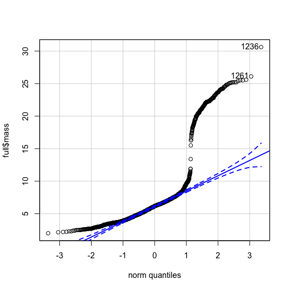

    [1] 1236 1261

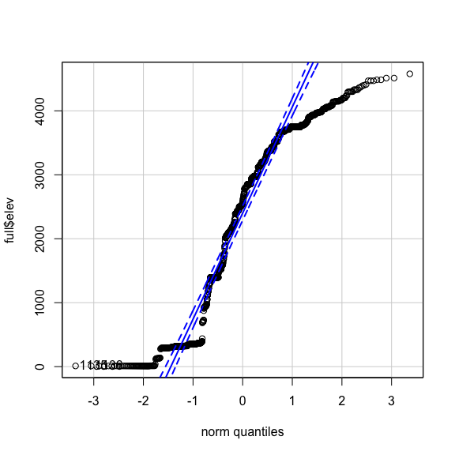

    [1] 1135 1136

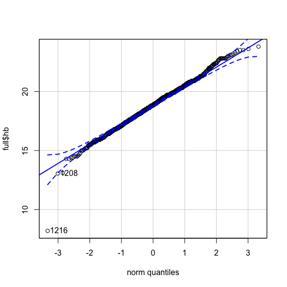

    [1] 1216 1208

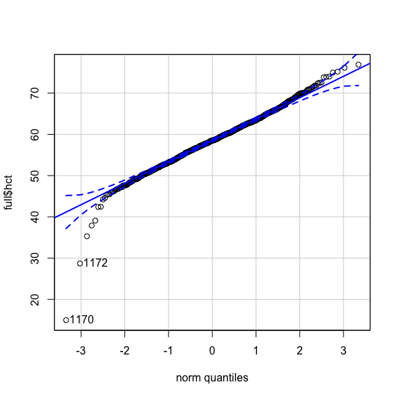

    [1] 1170 1172

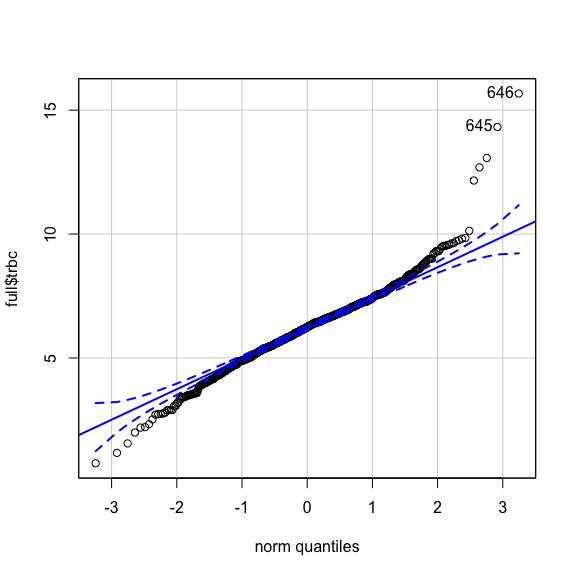

    [1] 646 645

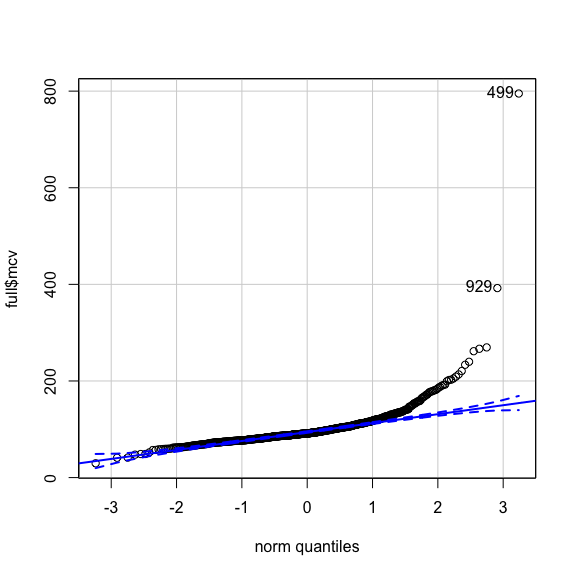

    [1] 499 929


    [1] 499 507

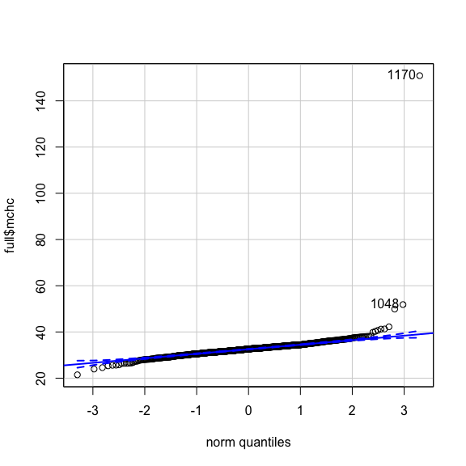

    [1] 1170 1048

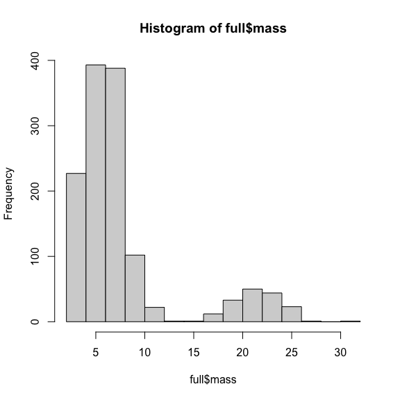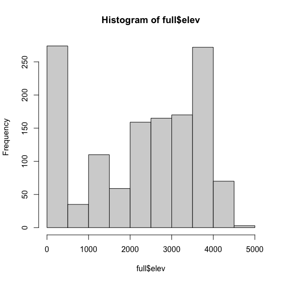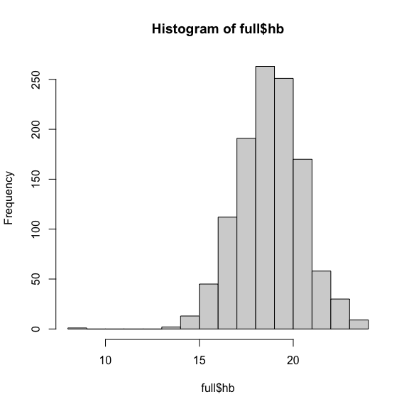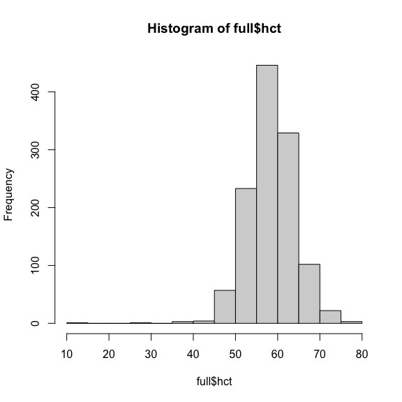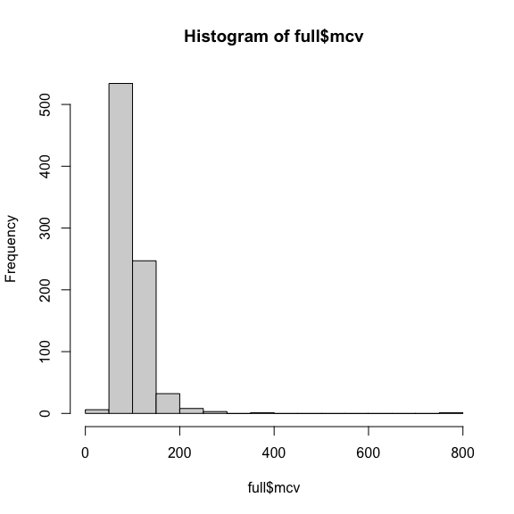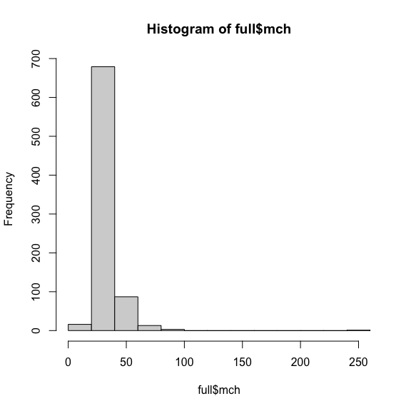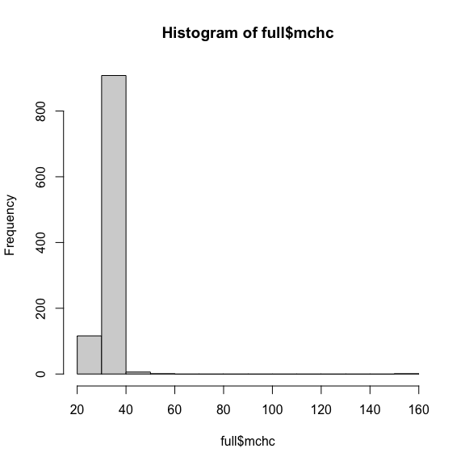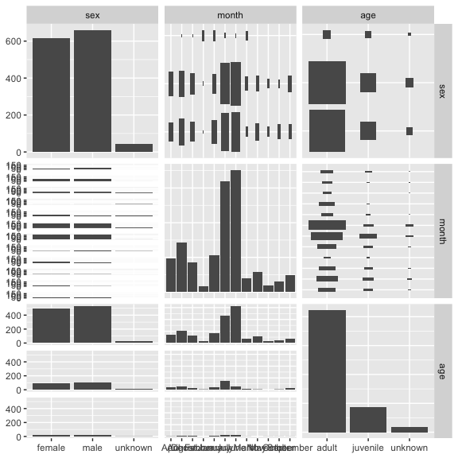

Drop outlier values for blood parameters
========================================

note: you CANNOT run na.omit on your subsetted data or you’ll be left
with only 18 observations. I think the best approach is to create
separate subsets that remove outliers for each possible response
variable of interest; that way, you’ll retain as many values as possible
in the subsetted dataset

``` r
# FULL DATASET OUTLIERS 
# For [Hb]: drop any value <14 or >25
# DuBay and Witt range from 13.2-21.4 g/dl
full <- full[-which(full$hb < 14 | full$hb > 25),] # drop Hb <14 # -3 observations 

# for Hct: drop any value <35 or >75
# (we originally had this set to 72 but I bumped it to 75 after examining distribution)
# DuBay and Witt range from 46.3-58.1 for Hct
full <- full[-which(full$hct < 35 | full$hct > 75),] # 5 observations 
# Campbell and Ellis report "normal" range for birds 35-55
# <35% suggests anemia; >55% suggests dehyrdation or erythrocytocis (polycythemia; increase in RBCs)
# They note that PCV > 70% is usually indicative of chronic pulmonary disease 

# For TRBC: drop any value <2 or >10
# I read somewhere online that bird 'normal' range is 2.5-4.5, with lower indicating anemia
# Full Campbell and Ellis range from Table B3 is 1.2-4.7
# We expect these values to be higher because of altitude effects
# Based on inspection of the distribution, we pick an informed range of 2-10
full <- full[-which(full$trbc < 2 | full$trbc > 10),] # -10 observations 


# Note: Campbell and Ellis 2007 say: 
# "assessment of abnormal values of MCV, MCH, and MCHC has not been properly evaluted in birds" - so outliers are up to us

# for MCV: drop any value <50 or >200
full <- full[-which(full$mcv < 50 | full$mcv > 150),] # >30 observations 
# Cambpell & Ellis note that 308 MCV is "large" and indicative of younger cells while 128 is smaller, suggests older cells
# I made the upper limit cut-off 150 instead of 200 after looking at distributions again; makes hist and qqPlots look better

# for MCHC: drop any value <20 or >42
# Campbell and Ellis values range from 20-38.5 (Table B3); Dubay & Witt values range from 
# DuBay and Witt range from 26.5-36.9 g/dl
full <- full[-which(full$mchc < 20 | full$mchc > 42),] # -3 observations 
# Leave for now; consider making this a more stringent 22-40

# for MCH: drop any value 
# Elarabany 2018 values for two duck species range from 24.6-31.1 PG; normal range for humans is 32-36 gm/dl 
full <- full[-which(full$mch < 18 | full$mch > 50),] # 4 observations 

# Take a look at the unique number of species in the dataset and observations per species:
sp.count.full <- full %>% group_by(species) %>% summarise(count = length(nk))
# Should be 77 total species 
write.csv(sp.count.full, "/Users/Jessie/Dropbox (MSBbirds)/Rdirectory/ComparativeHummingbirdBlood/HumBlood_species_list.csv")

# The plots/distributions above certainly look a LOT better after removing outliers
# Total outlier points dropped: 68 of 1,317
# 1,249 total data points for analysis
```

Note about outlier removal: Since dropping extreme values for e.g. MCV
leads to a LOT of lost data, another thing I could do is JUST remove
outliers for individual model datasets. I could then check the
distributions of individual model data sets before working with them,
and this would allow me to ditch 8 weird MCV values but keep the
associated perfectly regular hemoglobin values, for example.

Assess age-based outliers
=========================

Blood data values are anomalous in in nestlings and fledglings and
normalize quickly within a few months of fledging. Bursa lasts longer
than anomalous juvenile blood characteristics, so presence/absence of
bursa isn’t 100% correlative with ages that would be important for blood
analyses. Jessie, Chris, and Ethan decided that looking at a
*combination* of characteristics is the best approach: - First,
eliminate anomalous blood values (see code chunks above) - Then, analyze
distribution of blood values. If these look normal and fit in with
others, don’t remove on the basis of having a bursa. But, if blood
values look weird *AND* a bird has a “large” bursa, then remove value. -
“Large” bursa is \~2x2 mm or greater for hummingbirds, indicative of a
bird recently out of the nest.  
- This approach allows us to identify and possibly drop any errant
values caused by age and retain all values of juveniles that fall within
the “normal” adult range. - Also NOTE: Any non-vouchered (i.e. tracked)
Patagona whose age was scored by plumage shouldn’t be eliminated, as
juvenile plumage lasts much longer than anomalous juvenile blood values.
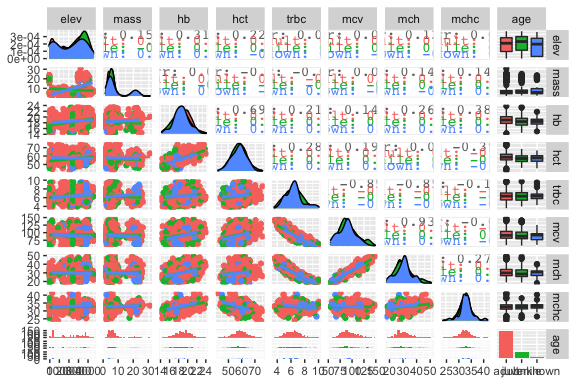

------------------------------------------------------------------------

Wrangling MSB wing loading data
===============================

``` r
library(tidyr)

# Need to merge with full dataset
# and copy down species mean values for all the species records 

# Now change column names 
names(wload)[names(wload) == "mass_g"] <- "wm" # wing mass: units = grams 
names(wload)[names(wload) == "wing_area_mm2"] <- "wa" # wing area: units = mm2
names(wload)[names(wload) == "wing_loading"] <- "wl" # wing loading
# the 'n' clolumn corresponds to # samples used to calculate wing loading (data that went into Skandalis et al. 2017)

# Merge full data w/ MSB wing loading data 
full <- merge(full, wload, by.x="species", by.y="species", all.x=TRUE) 
# by.x corresponds to column to merge from full; by.y corresponds to column to merge from wload
# Because both data frames have same col name, by.x and by.y are the same; in Stotz example below, col names differ 
# all.x=TRUE argument means don't drop data if there isn't an exact match w/ wload 
# What I want: number of rows should be 1,249 (same as full), wing loading data should exist for wload species = SUCCESS! 
# GOOD NEWS: Merging in this way copies each species mean value down for all representatives of that species = GOOD. 

# Look at possible correlations between wing loading and the 6 blood parameters of interest 
p <- ggpairs(subset(full, select = c(elev, mass, wl, hb, hct, trbc, mcv, mch, mchc))) 
print(p)
```

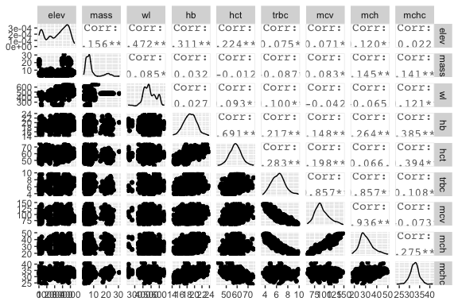

``` r
# Remember that not all species have wing loading data, so this won't print for all (i.e. you'll get 'warning' message)
# Transformations of wing data now happen in humblood_modeling.Rmd
```

Wrangle Stotz
=============

See Ethan Linck’s code here for smooth Stotz merging:
<a href="https://github.com/elinck/andean_range_limits/blob/master/scripts/01_blood_data_exploration.Rmd" class="uri">https://github.com/elinck/andean_range_limits/blob/master/scripts/01_blood_data_exploration.Rmd</a>

``` r
# Subset Stotz by just variables you want 
stotz.sub <- cbind.data.frame(stotz$GENUS, stotz$SPECIES, stotz$MIN, stotz$MAX, stotz$MIDPT.ELEV) 
colnames(stotz.sub) <- c("genus", "species", "elev_min", "elev_max", "elev_midpt") # assign column names 
stotz.sub$binomial <- paste0(stotz.sub$genus, " ", stotz.sub$species) # Combine genus and species cols into one  
full1 <- merge(full, stotz.sub, by.x = "species", by.y = "binomial", all.x=TRUE) # Merge full data w/ Stotz 
# by.x corresponds to column to merge from full; by.y corresponds to column to merge from stotz.sub
# The data frames have different col name, so by.x and by.y are the same
# all.x=TRUE argument means don't drop data if there isn't an exact match w/ Stotz 
head(full1)
```

                    species rowID     nk msb_cat_no prep_num              cat_owner
    1 Adelomyia melanogenys   110 161267      27493  JNZ 197 Jano Alex Nunez Zapata
    2 Adelomyia melanogenys   836 171892      35166 DCS 7188       Donna C. Schmitt
    3 Adelomyia melanogenys   830 171857      35131 DCS 7171       Donna C. Schmitt
    4 Adelomyia melanogenys   504 163838      32166 DCS 6009       Donna C. Schmitt
    5 Adelomyia melanogenys   491 163657      31985  JNZ 714 Jano Alex Nunez Zapata
    6 Adelomyia melanogenys    80 161116      27344 ABJ 1729      Andrew B. Johnson
         sex   age month year      locality elev department        lat       lon
    1   male adult April 2007     San Pedro 1395      Cuzco -13.055500 -71.54667
    2   male adult  July 2010 Bosque Cachil 2500  Cajamarca  -7.398033 -78.77827
    3   male adult  July 2010 Bosque Cachil 2500  Cajamarca  -7.398033 -78.77827
    4   male adult  July 2008      Tullanya 2147   Amazonas  -6.101900 -78.34317
    5 female adult  July 2008      Tullanya 2052   Amazonas  -6.104433 -78.34158
    6   male adult April 2007     San Pedro 1395      Cuzco -13.055500 -71.54667
      mass   hb      hct trbc       mcv     mchc      mch wing  n       wa     wm
    1 3.58 17.1 51.65017 6.91  74.74698 33.10735 24.74674   NA 26 1944.381 3.7686
    2 4.36 19.0 65.30733   NA        NA 29.09321       NA   NA 26 1944.381 3.7686
    3 4.55 18.8 64.90132   NA        NA 28.96706       NA   NA 26 1944.381 3.7686
    4 4.00 17.3 51.22768 4.85 105.62408 33.77081 35.67010   NA 26 1944.381 3.7686
    5 3.49 20.3 55.93407 5.52 101.32983 36.29273 36.77536   NA 26 1944.381 3.7686
    6 3.40 17.4 63.04348 5.63 111.97776 27.60000 30.90586   NA 26 1944.381 3.7686
            wl     genus   species.y elev_min elev_max elev_midpt
    1 515.9484 Adelomyia melanogenys     1100     2300       1200
    2 515.9484 Adelomyia melanogenys     1100     2300       1200
    3 515.9484 Adelomyia melanogenys     1100     2300       1200
    4 515.9484 Adelomyia melanogenys     1100     2300       1200
    5 515.9484 Adelomyia melanogenys     1100     2300       1200
    6 515.9484 Adelomyia melanogenys     1100     2300       1200

``` r
# How many unique species and records are in this dataset?  
length(unique(full1$species)) # number of unique species
```

    [1] 77

``` r
nrow(full1) # number of unique records
```

    [1] 1249

``` r
# We should have all 77 species 
# Number of rows should match 'full'; aka be n=1283

# ID which species failed to pick up elev range data w/ the Stotz data merge:
full1[is.na(full1$elev_min),]$species %>% unique() %>% length() # 11 total
```

    [1] 11

``` r
# Identify which ones: 
missing <- full1[is.na(full1$elev_min),]$species %>% unique(); missing
```

     [1] Aglaiocercus kingii      Chaetocercus mulsant     Doryfera ludovicae      
     [4] Eriocnemis aline         Eriocnemis vestita       Glaucis hirsutus        
     [7] Heliangelus micraster    Heliodoxa aurescens      Oreotrochilus estella   
    [10] Phaethornis atrimentalis Sephanoides sephaniodes 
    77 Levels: Adelomyia melanogenys ... Threnetes leucurus

``` r
# All are related to typos and/or taxonomy changes  

# Eyeball Stotz data, fill in gaps tediously
# AKA: take names of 'missing' df, use these to manually fill in gaps by inputting Stotz Excel sheet values
# Note, I had previously called index column names (elev_min=[28], elev_max=[29], elev_midpt=[30]), BUT, I didn't like this: 
# Every time I updated data frame above I had to tediously update column numbers and things shuffled; better to call names.
# But FYI, old line of code looked like: 
# full1[full1$species==missing[1],][28]  <- 1300 # [28] for elev_min, etc etc

full1[full1$species==missing[1],][, "elev_min"] <- 1300 # Aglaiocercus kingii # kingi in Stotz
full1[full1$species==missing[1],][, "elev_max"] <- 2600 # Aglaiocercus kingii
full1[full1$species==missing[1],][, "elev_midpt"] <- 1300 # Aglaiocercus kingii

full1[full1$species==missing[2],][, "elev_min"] <- 900 # Chaetocercus mulsant # Acestrura mulsant in Stotz
full1[full1$species==missing[2],][, "elev_max"] <- 2800 # Chaetocercus mulsant
full1[full1$species==missing[2],][, "elev_midpt"] <- 1900 # Chaetocercus mulsant

full1[full1$species==missing[3],][, "elev_min"] <- 1200 # Doryfera ludovicae # ludoviciae in Stotz
full1[full1$species==missing[3],][, "elev_max"] <- 2800 # Doryfera ludovicae
full1[full1$species==missing[3],][, "elev_midpt"] <- 1600 # Doryfera ludovicae

full1[full1$species==missing[4],][, "elev_min"] <- 2000 # Eriocnemis aline # alinae in Stotz
full1[full1$species==missing[4],][, "elev_max"] <- 2800 # Eriocnemis aline
full1[full1$species==missing[4],][, "elev_midpt"] <- 800  # Eriocnemis aline

full1[full1$species==missing[5],][, "elev_min"] <- 2250 # Eriocnemis vestita # vestitus in Stotz; but only 3 so dropped 
full1[full1$species==missing[5],][, "elev_max"] <- 3850 # Eriocnemis vestita
full1[full1$species==missing[5],][, "elev_midpt"] <- 1600 # Eriocnemis vestita

full1[full1$species==missing[6],][, "elev_min"] <- 0    # Glaucis hirsutus # hirsutas in Stotz
full1[full1$species==missing[6],][, "elev_max"] <- 1100 # Glaucis hirsutus
full1[full1$species==missing[6],][, "elev_midpt"] <- 1100 # Glaucis hirsutus

full1[full1$species==missing[7],][, "elev_min"] <- 2400 # Heliangelus micraster # spelling issue in Stotz
full1[full1$species==missing[7],][, "elev_max"] <- 2900 # Heliangelus micraster
full1[full1$species==missing[7],][, "elev_midpt"] <- 500  # Heliangelus micraster

full1[full1$species==missing[8],][, "elev_min"] <- 0    # Heliodoxa aurescens # Polyplancta aurescens in Stotz
full1[full1$species==missing[8],][, "elev_max"] <- 1050 # Heliodoxa aurescens
full1[full1$species==missing[8],][, "elev_midpt"] <- 1050 # Heliodoxa aurescens

full1[full1$species==missing[9],][, "elev_min"] <- 3500 # O. estella # (estella) estella & (estella) chimborazo in Stotz 
full1[full1$species==missing[9],][, "elev_max"] <- 4600 # Oreotrochilus estella
full1[full1$species==missing[9],][, "elev_midpt"] <- 1100 # Oreotrochilus estella

full1[full1$species==missing[10],][, "elev_min"] <- 0 # Phaethornis atrimentalis # Not in Stotz; adding Schulenberg 2007 ranges
full1[full1$species==missing[10],][, "elev_max"] <- 1100 # Phaethornis atrimentalis
full1[full1$species==missing[10],][, "elev_midpt"] <- 1100 # Phaethornis atrimentalis

full1[full1$species==missing[11],][, "elev_min"] <- 0 # Sephanoides sephaniodes # Sephanoides sephanOIdes in Stotz...of course.
full1[full1$species==missing[11],][, "elev_max"] <- 2000 # Sephanoides sephaniodes
full1[full1$species==missing[11],][, "elev_midpt"] <- 2000 # Sephanoides sephaniodes

# Now missing should be 0
```

Species elevational range adjustments
=====================================

Stotz (Parker et al. 1996) is a good baseline for elevational ranges but
is frequently inaccurate, and in some cases, outdated. Adjust species
elevational ranges based on Schulenberg et al. 2007 Birds of Peru,
museum records, other field guides (if necessary), and working
knowledge.

``` r
# Note: this process could be simplified with a nice function like the one Ethan wrote for Linck et al. all-species
# blood comparison. *But* I committed to this clunky, "species-specific-personalized" method, so sticking with it for now.

# First, figure out which species MSB collection elevations exceed max and which exceed min
# Species collection elevs > elev_max 
max_exceed <- full1[full1$elev > full1$elev_max,]$species %>% unique(); max_exceed
```

     [1] Adelomyia melanogenys        Aglaeactis castelnaudii     
     [3] Aglaiocercus kingii          Amazilia amazilia           
     [5] Amazilia chionogaster        Amazilia viridicauda        
     [7] Boissonneaua matthewsii      Campylopterus largipennis   
     [9] Campylopterus villaviscensio Chalcostigma herrani        
    [11] Coeligena violifer           Colibri coruscans           
    [13] Colibri thalassinus          Doryfera ludovicae          
    [15] Ensifera ensifera            Eriocnemis luciani          
    [17] Heliangelus micraster        Heliangelus viola           
    [19] Heliodoxa aurescens          Klais guimeti               
    [21] Lafresnaya lafresnayi        Lesbia nuna                 
    [23] Leucippus taczanowskii       Metallura eupogon           
    [25] Metallura tyrianthina        Myrmia micrura              
    [27] Patagona gigas               Phaethornis atrimentalis    
    [29] Phaethornis hispidus         Phaethornis malaris         
    [31] Phaethornis philippii        Polyonymus caroli           
    [33] Pterophanes cyanopterus      Taphrospilus hypostictus    
    [35] Threnetes leucurus          
    77 Levels: Adelomyia melanogenys ... Threnetes leucurus

``` r
# After adjusting, 0. 

# Species collection elevs > elev_max 
min_exceed <- full1[full1$elev < full1$elev_min,]$species %>% unique(); min_exceed
```

    [1] Aglaeactis cupripennis Coeligena lutetiae     Coeligena violifer    
    [4] Haplophaedia aureliae  Heliodoxa leadbeateri  Lesbia nuna           
    [7] Lesbia victoriae       Oreotrochilus estella  Patagona gigas        
    77 Levels: Adelomyia melanogenys ... Threnetes leucurus

``` r
# Before adjusting, 4: Amazilia chionogaster, Haplophaedia aureliae, Lesbia victoriae, Oreotrochilus estella 
# After adjusting, 0

# Patagona gigas 
# Cite Williamson and Witt 2020, ENSM  
full1[full1$species=="Patagona gigas",][, "elev_min"] <- 0    # Min elev, determined from ENSM paper 
full1[full1$species=="Patagona gigas",][, "elev_max"] <- 4830 # Max elev, determined from ENSM paper

# Rhodopis vesper 
full1[full1$species=="Rhodopis vesper",][, "elev_max"] <- 3800 # Max elev, determined Schulenberg et al. 2007

# Haplophaedia aureliae
# Schulenberg et al. 2007 doesn't list an elev range (just found in under- and midstory of humid montane forest)
# Stotz min 1,400, MSB collection min is 1051; rounding down to 1050
full1[full1$species=="Haplophaedia aureliae",][, "elev_min"] <- 1050    # Min elev

# Polyonymus caroli
# Schulenberg et al. 2007 lists 2100-3400 m; we know they're common at 3,700-3,800 m in Lima 
# We've collected up to 4,062 m in Potaga, so I'll bump the max elev to 4,100
full1[full1$species=="Polyonymus caroli",][, "elev_max"] <- 4100 # Max elev
# Should lower limit be adjusted from 1,500 m (Stotz) to 2,100 m (Schulenberg)?

# Florisuga mellivora
# Schulenberg et al. 2007 says up to 1,200 m
full1[full1$species=="Florisuga mellivora",][, "elev_max"] <- 1200 # Max elev

# Threnetes leucurus
# Schulenberg et al. 2007 says up to 1200 m but locally to 1800 m; we've collected to ~1,700 m, so I'll go with 1,800 m
full1[full1$species=="Threnetes leucurus",][, "elev_max"] <- 1800 # Max elev

# Phaethornis malaris
# Schulenberg et al. 2007 says max 1,300 m
# MSB voucher shows collected elev of 1673 at Plataforma; adjusting accordingly
full1[full1$species=="Phaethornis malaris",][, "elev_max"] <- 1700 # Max elev

# Phaethornis hispidus
# Schulenberg et al. 2007 says max 850 m, locally to 1400 m
full1[full1$species=="Phaethornis hispidus",][, "elev_max"] <- 850 # Max elev

# Phaethornis philippii
# Schulenberg et al. 2007 says below 500 m
full1[full1$species=="Phaethornis philippii",][, "elev_max"] <- 500 # Max elev

# Doryfera ludovicae
# Schulenberg et al. 2007 1,000-2,500; down to 800 m and up to 2,850 in south 
full1[full1$species=="Doryfera ludovicae",][, "elev_min"] <- 1000 # Min elev
full1[full1$species=="Doryfera ludovicae",][, "elev_max"] <- 2900 # Max elev # bumping up to match Schulenberg & specimen records

# Colibri coruscans
# Stotz seems way off for this well-known generalist; Schulenberg says 400-4,500 m
full1[full1$species=="Colibri coruscans",][, "elev_min"] <- 400 # Min elev
full1[full1$species=="Colibri coruscans",][, "elev_max"] <- 4500 # Max elev 

# Colibri thalassinus (gets changed to Colibri cyanotus below)
# Stotz: Mostly 1300-2800 m, locally 1000-3300 m; also on west slop in NW at 1500-2400 m
# MSB record up to 3,153 m, rounding to 3,200
full1[full1$species=="Colibri thalassinus",][, "elev_max"] <- 3200 # Max elev 

# Heliangelus micraster
# Schulenberg lists range as 2200-3000 
# MSB specimen records reach nearly 3,372
full1[full1$species=="Heliangelus micraster",][, "elev_max"] <- 3400 # Max elev 

# Heliangelus viola
# Schulenberg et al. 2007: 1800-3200 m; note that our specimen records reach 3,279 m
full1[full1$species=="Heliangelus viola",][, "elev_min"] <- 1800 # Min elev
full1[full1$species=="Heliangelus viola",][, "elev_max"] <- 3300 # Max elev

# Adelomyia melanogenys
# Schulenberg et al. 2007: 1000-2900 m; note that our specimen records reach ~2,600 m
full1[full1$species=="Adelomyia melanogenys",][, "elev_min"] <- 1000 # Min elev
full1[full1$species=="Adelomyia melanogenys",][, "elev_max"] <- 2900 # Max elev

# Aglaiocercus kingii
# Schulenberg et al. 2007: 1200-2500 m, locally to 2800 m; our specimen records reach 2,858 m.
full1[full1$species=="Aglaiocercus kingii",][, "elev_min"] <- 1200 # Min elev
full1[full1$species=="Aglaiocercus kingii",][, "elev_max"] <- 2900 # Max elev # Bumping to 2,900 to take into account MSB records

# Lesbia victoriae
# Schulenberg et al. 2007: 2700-4100
# MSB specimen records reach low of 2,338m; rounding down to 2,300 m
full1[full1$species=="Lesbia victoriae",][, "elev_min"] <- 2300 # Min elev
full1[full1$species=="Lesbia victoriae",][, "elev_max"] <- 4100 # Max elev 

# Lesbia nuna
# Schulenberg et al. 2007: 1700-3800 m
# MSB specimen records reach ~4,036 m from Cordillera Vilcanota
full1[full1$species=="Lesbia nuna",][, "elev_min"] <- 1700 # Min elev
full1[full1$species=="Lesbia nuna",][, "elev_max"] <- 4050 # Max elev

# Oreonympha nobilis
# Schulenberg et al. 2007: 2700-3900 m
full1[full1$species=="Oreonympha nobilis",][, "elev_min"] <- 2700 # Min elev
full1[full1$species=="Oreonympha nobilis",][, "elev_max"] <- 3900 # Max elev

# Metallura phoebe
# Schulenberg et al. 2007: 2700-4300
full1[full1$species=="Metallura phoebe",][, "elev_min"] <- 2700 # Min elev
full1[full1$species=="Metallura phoebe",][, "elev_max"] <- 4300 # Max elev

# Metallura tyrianthina
# Schulenberg et al. 2007: 2400-4200 m; ocasionally down to 1900 m
full1[full1$species=="Metallura tyrianthina",][, "elev_max"] <- 4200 # Max elev

# Metallura eupogon
# Schulenberg et al. 2007: 3100-3800
full1[full1$species=="Metallura eupogon",][, "elev_min"] <- 3100 # Min elev
full1[full1$species=="Metallura eupogon",][, "elev_max"] <- 3800 # Max elev

# Eriocnemis vestita
# Schulenberg et al. 2007: 2450-3200 m
# MSB records to 3,293 m, so rounding upper limit to 3,300
full1[full1$species=="Eriocnemis vestita",][, "elev_min"] <- 2450 # Min elev
full1[full1$species=="Eriocnemis vestita",][, "elev_max"] <- 3300 # Max elev # Stotz was set to 3,800; seems high
# Check upper range limit w/ Chris 

# Eriocnemis luciani
# Schulenberg et al. 2007: 2450-3200 m
# MSB records to 3,779 m, so rounding upper limit to 3,800
full1[full1$species=="Eriocnemis luciani",][, "elev_min"] <- 2450 # Min elev
full1[full1$species=="Eriocnemis luciani",][, "elev_max"] <- 3800 # Max elev 

# Aglaeactis cupripennis
# Schulenberg et al. 2007: 2500-4600 m
full1[full1$species=="Aglaeactis cupripennis",][, "elev_min"] <- 2500 # Min elev
full1[full1$species=="Aglaeactis cupripennis",][, "elev_max"] <- 4600 # Max elev 

# Aglaeactis castelnaudii
# Schulenberg et al. 2007: 2500-4100 m
full1[full1$species=="Aglaeactis castelnaudii",][, "elev_min"] <- 2600 # Min elev
full1[full1$species=="Aglaeactis castelnaudii",][, "elev_max"] <- 4600 # Max elev # Bumping up based on specimen records
# Talk w/ Chris about this one - seems to be found a lot higher than recorded 

# Coeligena coeligena
# Schulenberg et al. 2007: 1000-2200; locally to 2600 m
full1[full1$species=="Coeligena coeligena",][, "elev_min"] <- 1000 # Min elev
full1[full1$species=="Coeligena coeligena",][, "elev_max"] <- 2600 # Max elev 

# Coeligena torquata
# Schulenberg et al. 2007: 1800-3000 m
full1[full1$species=="Coeligena torquata",][, "elev_min"] <- 1800 # Min elev
full1[full1$species=="Coeligena torquata",][, "elev_max"] <- 3000 # Max elev 
 
# Coeligena lutetiae
# Schulenberg et al. 2007: 2600-2950; Stotz says 3000-3750; these are two very different ranges
full1[full1$species=="Coeligena lutetiae",][, "elev_min"] <- 2600 # Min elev
full1[full1$species=="Coeligena lutetiae",][, "elev_max"] <- 3700 # Max elev 

# Coeligena violifer
# Schulenberg et al. 2007: 2500-3900 m; occasionally down to 1900 m
full1[full1$species=="Coeligena violifer",][, "elev_min"] <- 2500 # Min elev
full1[full1$species=="Coeligena violifer",][, "elev_max"] <- 3900 # Max elev 
 
# Ensifera ensifera
# Schulenberg et al. 2007: 2400-3600
# MSB records up to 3,835 m; bumping to 3,850
full1[full1$species=="Ensifera ensifera",][, "elev_min"] <- 2400 # Min elev
full1[full1$species=="Ensifera ensifera",][, "elev_max"] <- 3850 # Max elev
 
# Pterophanes cyanopterus
# Stotz and Schulenberg match exactly (2600-3700 m)
# MSB specimen records reach 4200m
full1[full1$species=="Pterophanes cyanopterus",][, "elev_max"] <- 4200 # Max elev 

# Boissonneaua matthewsii
# Schulenberg et al. 2007: 1500-3300 m
full1[full1$species=="Boissonneaua matthewsii",][, "elev_min"] <- 1500 # Min elev
full1[full1$species=="Boissonneaua matthewsii",][, "elev_max"] <- 3300 # Max elev

# Ocreatus underwoodii
# Schulenberg et al. 2007: 1000-2400 m
full1[full1$species=="Ocreatus underwoodii",][, "elev_min"] <- 1000 # Min elev
full1[full1$species=="Ocreatus underwoodii",][, "elev_max"] <- 2400 # Max elev

# Heliodoxa leadbeateri
# Schulenberg et al. 2007: 900-2300 m
full1[full1$species=="Heliodoxa leadbeateri",][, "elev_min"] <- 900 # Min elev

# Heliodoxa aurescens
# Schulenberg et al. 2007: Below 1400 m
full1[full1$species=="Heliodoxa aurescens",][, "elev_max"] <- 1400 # Max elev

# Campylopterus largipennis
# Schulenberg et al. 2007: Up to 1300 m
full1[full1$species=="Campylopterus largipennis",][, "elev_max"] <- 1300 # Max elev

# Campylopterus villaviscensio is interesting
# Schulenberg et al. 2007: from 1050-1400 m
# All MSB vouchers exceed upper range, with highest at 1776 m
full1[full1$species=="Campylopterus villaviscensio",][, "elev_max"] <- 1800 # Max elev

# Leucippus taczanowskii
# Schulenberg et al. 2007: 1000-2400 m
full1[full1$species=="Leucippus taczanowskii",][, "elev_min"] <- 350 # Min elev
full1[full1$species=="Leucippus taczanowskii",][, "elev_max"] <- 2800 # Max elev
# Ask Chris about this one too 

# Amazilia viridicauda
# Schulenberg et al. 2007: 1000-2750 m
# MSB specimen records collected to 3,005 m
full1[full1$species=="Amazilia viridicauda",][, "elev_min"] <- 1000 # Min elev
full1[full1$species=="Amazilia viridicauda",][, "elev_max"] <- 3050 # Max elev # Bumping up based on specimen records

# Amazilia chionogaster
# Schulenberg et al. 2007: primarily 1200-3500, locally as low as 350
# MSB low record is 294 m, so rounding down to 250 m
full1[full1$species=="Amazilia chionogaster",][, "elev_min"] <- 250 # Min elev
full1[full1$species=="Amazilia chionogaster",][, "elev_max"] <- 3500 # Max elev 
# Ask Chris about this one too 

# Taphrospilus hypostictus
# Schulenberg et al. 2007: 750-1500 m, occasionally up to 2800 m in upper Apurimac Valley 
full1[full1$species=="Taphrospilus hypostictus",][, "elev_max"] <- 1500 # Max elev 

# Amazilia amazilia
# Schulenberg et al. 2007: mostly below 1000, locally up to 2400 m
full1[full1$species=="Amazilia amazilia",][, "elev_max"] <- 2400 # Max elev 
# Ask Chris about this one too 

# Chrysuronia oenone
# Schulenberg et al. 2007: Lowlands to 1700 m
full1[full1$species=="Chrysuronia oenone",][, "elev_max"] <- 1700 # Max elev 

# Myrmia micrura
# Stotz says range is just sea level; Schulenberg et al. 2007: sea level to 1200 m locally
full1[full1$species=="Myrmia micrura",][, "elev_max"] <- 1200 # Max elev

# Klais guimeti
# Schulenberg et al. 2007: 500-1550
# MSB collection records go up to 1673 m, so adjusting upper limit to 1700 accordingly
full1[full1$species=="Klais guimeti",][, "elev_max"] <- 1700 # Max elev 

# Phaethornis atrimentalis
# Schulenberg et al. 2007: up to 1,100 m
# MSB collection records go up to 1209 m, so adjusting upper limit to 1250 accordingly
full1[full1$species=="Phaethornis atrimentalis",][, "elev_max"] <- 1250 # Max elev

# Lafresnaya lafresnayi
# Schulenberg et al. 2007: 1800-3200 m; Stotz to 3,350 m
# MSB collection records go up to 3376 m, so adjusting upper limit to 3400 accordingly
full1[full1$species=="Lafresnaya lafresnayi",][, "elev_max"] <- 3400 # Max elev

# Chalcostigma herrani
# Schulenberg et al. 2007: 2450-3100
# MSB collection records go up to 3421 m, so adjusting upper limit to 3450 accordingly
full1[full1$species=="Chalcostigma herrani",][, "elev_max"] <- 3450 # Max elev

# Oreotrochilus estella
# Schulenberg et al. 2007: 3400-4600, locally down to 3,000m
# MSB collection records go down to 3,400. But because Schulenberg uses 3,000, I'll bump down to that as low point.
full1[full1$species=="Oreotrochilus estella",][, "elev_min"] <- 3000 # Min elev


# Eyeball full1 species count to verify you inspected all 
sp.count.full1 <- full1 %>% group_by(species) %>% summarise(count = length(nk)); sp.count.full1
```

    # A tibble: 77 x 2
       species                    count
       <fct>                      <int>
     1 Adelomyia melanogenys         47
     2 Aglaeactis castelnaudii       16
     3 Aglaeactis cupripennis        17
     4 Aglaiocercus kingii           21
     5 Amazilia amazilia             65
     6 Amazilia chionogaster          9
     7 Amazilia franciae              1
     8 Amazilia lactea                3
     9 Amazilia viridicauda           8
    10 Anthracothorax nigricollis     2
    # … with 67 more rows

``` r
#write.csv(sp.count.full1, "AllHummingbird_SpeciesList.csv")
# Should be 77 total species 
```

Assign hummingbirds to approprite clades
========================================

Projecto-Garcia et al. 2013 lists many species and their associated
clades. Best phylogeny McGuire et al. 2014. For helpful future
reference, a list of hummingbirds and their respective clades:
<a href="https://www.wikiwand.com/en/List_of_hummingbird_species" class="uri">https://www.wikiwand.com/en/List_of_hummingbird_species</a>

``` r
# Note: Colibri thalassinus is now Mexican Violetear; Lesser Violetear should be Colibri cyanotus = rename level of this factor
levels(full1$species)[levels(full1$species)=="Colibri thalassinus"] <- "Colibri cyanotus"

full1$Clade <- NA # Instantiate new col; capitalize this for easy and nice plot formatting

# add clade labels for 9 hummingbird clades

# EMERALDS
full1$Clade[full1$species=="Amazilia amazilia" | 
           full1$species=="Amazilia chionogaster" | 
           full1$species=="Amazilia franciae" | 
           full1$species=="Amazilia lactea" | 
           full1$species=="Amazilia viridicauda" | 
           full1$species=="Chrysuronia oenone" | 
           full1$species=="Taphrospilus hypostictus" | 
           full1$species=="Thalurania furcata" | 
           full1$species=="Campylopterus largipennis" | 
           full1$species=="Campylopterus villaviscensio" | 
           full1$species=="Leucippus taczanowskii" | 
           full1$species=="Klais guimeti"] <- paste("Emerald")

# BEES 
full1$Clade[full1$species=="Calliphlox amethystina" | 
           full1$species=="Thaumastura cora" | 
           full1$species=="Chaetocercus mulsant" |
           full1$species=="Myrmia micrura" |
           full1$species=="Myrtis fanny" |
           full1$species=="Rhodopis vesper"] <- paste("Bee") 

# MOUNTAIN GEMS 
full1$Clade[full1$species=="Heliomaster longirostris"] <- paste("Mountain-gem")

# PATAGONA 
full1$Clade[full1$species=="Patagona gigas"] <- paste("Patagona") 

# COQUETTES (Andean clade)
full1$Clade[full1$species=="Phlogophilus harterti" | 
           full1$species=="Adelomyia melanogenys" | 
           full1$species=="Aglaiocercus kingii" | 
           full1$species=="Chalcostigma herrani" | 
           full1$species=="Chalcostigma ruficeps" | 
           full1$species=="Chalcostigma stanleyi" | 
           full1$species=="Heliangelus amethysticollis" | 
           full1$species=="Heliangelus micraster" | 
           full1$species=="Heliangelus viola" | 
           full1$species=="Metallura eupogon" | 
           full1$species=="Metallura phoebe" | 
           full1$species=="Metallura tyrianthina" | 
           full1$species=="Oreotrochilus estella" | 
           full1$species=="Oreotrochilus leucopleurus" | 
           full1$species=="Oreotrochilus melanogaster" | 
           full1$species=="Polyonymus caroli" | 
           full1$species=="Sephanoides sephaniodes" | 
           full1$species=="Oreonympha nobilis" |
           full1$species=="Lesbia nuna" |
           full1$species=="Lesbia victoriae"] <- paste("Coquette")

# BRILLIANTS (Andean clade)
full1$Clade[full1$species=="Aglaeactis castelnaudii" | 
           full1$species=="Aglaeactis cupripennis" | 
           full1$species=="Boissonneaua matthewsii" | 
           full1$species=="Coeligena coeligena" | 
           full1$species=="Coeligena iris" | 
           full1$species=="Coeligena lutetiae" | 
           full1$species=="Coeligena torquata" | 
           full1$species=="Coeligena violifer" | 
           full1$species=="Ensifera ensifera" | 
           full1$species=="Eriocnemis aline" | 
           full1$species=="Eriocnemis luciani" | 
           full1$species=="Eriocnemis vestita" | 
           full1$species=="Haplophaedia aureliae" | 
           full1$species=="Heliodoxa aurescens" | 
           full1$species=="Heliodoxa leadbeateri" | 
           full1$species=="Heliodoxa rubinoides" | 
           full1$species=="Lafresnaya lafresnayi" | 
           full1$species=="Ocreatus underwoodii" | 
           full1$species=="Pterophanes cyanopterus"] <- paste("Brilliant")

# MANGOS
full1$Clade[full1$species=="Anthracothorax nigricollis" | 
           full1$species=="Colibri coruscans" | 
           full1$species=="Colibri cyanotus" |  # Remember you changed Colibri thalassinus to cyanotus above 
           full1$species=="Doryfera ludovicae" |
           full1$species=="Schistes geoffroyi"] <- paste("Mango")

# HERMITS 
full1$Clade[full1$species=="Eutoxeres aquila" | 
           full1$species=="Eutoxeres condamini" | 
           full1$species=="Glaucis hirsutus" | 
           full1$species=="Phaethornis atrimentalis" | 
           full1$species=="Phaethornis guy" | 
           full1$species=="Phaethornis hispidus" | 
           full1$species=="Phaethornis malaris" | 
           full1$species=="Phaethornis philippii" | 
           full1$species=="Phaethornis ruber" | 
           full1$species=="Phaethornis stuarti" | 
           full1$species=="Phaethornis syrmatophorus" | 
           full1$species=="Threnetes leucurus"] <- paste("Hermit")

# TOPAZES AND JACOBINS 
full1$Clade[full1$species=="Florisuga mellivora"] <- paste("Topaz") 

# Summarize by clade 
clade.summary <- full1 %>% group_by(Clade) %>% summarise(count = length(species)); clade.summary
```

    # A tibble: 9 x 2
      Clade        count
      <chr>        <int>
    1 Bee             21
    2 Brilliant      269
    3 Coquette       388
    4 Emerald        163
    5 Hermit         128
    6 Mango          101
    7 Mountain-gem     1
    8 Patagona       156
    9 Topaz           22

Classify elev range breadth, elevational range class, and *P*O2 class
=====================================================================

Calculate elevational range position
====================================

``` r
# Elev_position = scale of 0-1 for individual positions along a species elev range (e.g. 0=bottom, 0.5=middle, 1=top)
# This is more meaningful than looking at elev_range width comparisons since my analysis is individual-level
# We expect that birds at the top of their range have higher blood values (generally) 
full1$elev_position <- 1-((full1$elev_max-full1$elev)/full1$elev_range)
 
# Any value >1 indicates that birds were collected higher than recorded max_elev; values <1 record the opposite
# Since I checked and vetted these above, all values should fall within 0-1
# Also remember: if I do want to 'automate' more, Ethan has nice function for this  
```

Save final dataset and adjust data structure for modeling
=========================================================

``` r
# Drop lingering rows from Stotz merge (some of which still have NAs due to taxonomic changes)
full1 <- full1[ , -which(names(full1) %in% c("genus","species.y"))] 

# save final dataset 
final <- full1

# All characters need to be made into factors 
str(final)
```

    'data.frame':   1249 obs. of  35 variables:
     $ species      : Factor w/ 77 levels "Adelomyia melanogenys",..: 1 1 1 1 1 1 1 1 1 1 ...
     $ rowID        : int  110 836 830 504 491 80 1044 1004 487 131 ...
     $ nk           : int  161267 171892 171857 163838 163657 161116 218700 176605 163620 161332 ...
     $ msb_cat_no   : chr  "27493" "35166" "35131" "32166" ...
     $ prep_num     : chr  "JNZ 197" "DCS 7188" "DCS 7171" "DCS 6009" ...
     $ cat_owner    : chr  "Jano Alex Nunez Zapata" "Donna C. Schmitt" "Donna C. Schmitt" "Donna C. Schmitt" ...
     $ sex          : chr  "male" "male" "male" "male" ...
     $ age          : chr  "adult" "adult" "adult" "adult" ...
     $ month        : chr  "April" "July" "July" "July" ...
     $ year         : int  2007 2010 2010 2008 2008 2007 2012 2012 2008 2007 ...
     $ locality     : chr  "San Pedro" "Bosque Cachil" "Bosque Cachil" "Tullanya" ...
     $ elev         : int  1395 2500 2500 2147 2052 1395 2694 1500 2240 1395 ...
     $ department   : chr  "Cuzco" "Cajamarca" "Cajamarca" "Amazonas" ...
     $ lat          : num  -13.1 -7.4 -7.4 -6.1 -6.1 ...
     $ lon          : num  -71.5 -78.8 -78.8 -78.3 -78.3 ...
     $ mass         : num  3.58 4.36 4.55 4 3.49 3.4 3.67 3.36 3.74 2.7 ...
     $ hb           : num  17.1 19 18.8 17.3 20.3 17.4 19 17.6 17.7 20 ...
     $ hct          : num  51.7 65.3 64.9 51.2 55.9 ...
     $ trbc         : num  6.91 NA NA 4.85 5.52 5.63 NA NA 6.78 NA ...
     $ mcv          : num  74.7 NA NA 105.6 101.3 ...
     $ mchc         : num  33.1 29.1 29 33.8 36.3 ...
     $ mch          : num  24.7 NA NA 35.7 36.8 ...
     $ wing         : num  NA NA NA NA NA NA NA NA NA NA ...
     $ n            : int  26 26 26 26 26 26 26 26 26 26 ...
     $ wa           : num  1944 1944 1944 1944 1944 ...
     $ wm           : num  3.77 3.77 3.77 3.77 3.77 ...
     $ wl           : num  516 516 516 516 516 ...
     $ elev_min     : num  1000 1000 1000 1000 1000 1000 1000 1000 1000 1000 ...
     $ elev_max     : num  2900 2900 2900 2900 2900 2900 2900 2900 2900 2900 ...
     $ elev_midpt   : num  1950 1950 1950 1950 1950 1950 1950 1950 1950 1950 ...
     $ Clade        : chr  "Coquette" "Coquette" "Coquette" "Coquette" ...
     $ elev_range   : num  1900 1900 1900 1900 1900 1900 1900 1900 1900 1900 ...
     $ range_class  : chr  "neither" "neither" "neither" "neither" ...
     $ po2_class    : chr  "neither" "neither" "neither" "neither" ...
     $ elev_position: num  0.208 0.789 0.789 0.604 0.554 ...

``` r
final$sex <- as.factor(final$sex)
final$age <- as.factor(final$age)
final$month <- as.factor(final$month)
final$locality <- as.factor(final$locality)
final$department <- as.factor(final$department)
final$range_class <- as.factor(final$range_class)
final$po2_class <- as.factor(final$po2_class)
final$Clade <- as.factor(final$Clade)

# Looks good! Should be ready for modeling.
# Best approach for balancing NA omission w/ preserving data is probably to create a subset for each blood parameter
# e.g. subset to include JUST data you need for models, call datasets something like 'final.hb', 'final.hct', etc.
```

#### SPATIAL AND ENVIRONMENTAL DATA

Country polygons, elevation rasters, BioClim download
=====================================================

Download country polygons with elevation layers, crop Chile to mainland
extent to exclude Juan Fernandez Islands, merge country polygons, and
get climate data into country shapes.

    class      : Extent 
    xmin       : -109.455 
    xmax       : -66.41472 
    ymin       : -55.98403 
    ymax       : -17.50755 

    [1] TRUE

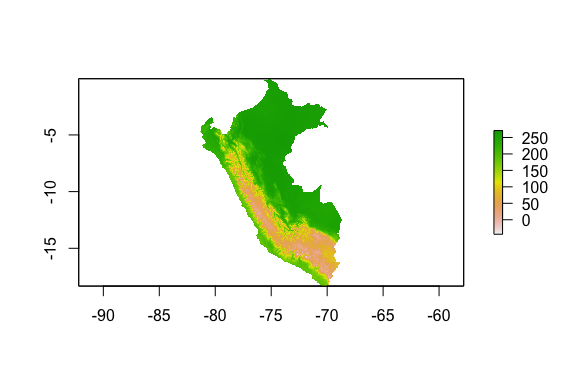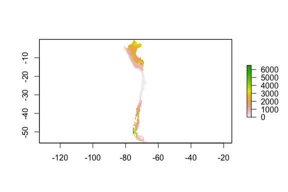

    [1] TRUE

Spatial coords PCA
==================

This is for variable reduction of BioClim variables; look at loadings to
understand which directions things work in. Collapse temp and aridity
variables and use first PCA axis in models.

``` r
# Code from McNew et al. 2020 (thanks for the help, SMM!)
# PCA and scale raster data for temp variables and precip variables

# Temperature PCA using BioClim vars 1-11
tempPCA <- rasterPCA(subset(peru_chile, 1:11), spca = TRUE) #creates a raster of PCA temp vals
summary(tempPCA$model) #PC1 has 73.4% of variation and 89.5% w/ PC1+PC2
```

    Importance of components:
                              Comp.1    Comp.2     Comp.3      Comp.4      Comp.5
    Standard deviation     2.8422861 1.3307249 1.00877715 0.290577444 0.188996606
    Proportion of Variance 0.7344173 0.1609844 0.09251194 0.007675932 0.003247247
    Cumulative Proportion  0.7344173 0.8954017 0.98791369 0.995589619 0.998836866
                                 Comp.6       Comp.7       Comp.8       Comp.9
    Standard deviation     0.0871772203 0.0560433309 0.0434610421 1.140708e-02
    Proportion of Variance 0.0006908971 0.0002855323 0.0001717147 1.182923e-05
    Cumulative Proportion  0.9995277629 0.9998132951 0.9999850099 9.999968e-01
                                Comp.10      Comp.11
    Standard deviation     5.896598e-03 1.359315e-08
    Proportion of Variance 3.160897e-06 1.679761e-17
    Cumulative Proportion  1.000000e+00 1.000000e+00

``` r
tempPCA$model$loadings #
```


    Loadings:
             Comp.1 Comp.2 Comp.3 Comp.4 Comp.5 Comp.6 Comp.7 Comp.8 Comp.9 Comp.10
    layer.1   0.349         0.118                       0.202  0.489  0.739  0.150 
    layer.2          0.734  0.107               -0.140  0.574 -0.293               
    layer.3   0.248  0.437 -0.369 -0.397 -0.604        -0.237  0.153               
    layer.4  -0.261 -0.208  0.590        -0.652         0.213               -0.233 
    layer.5   0.327         0.343                0.461 -0.237 -0.406               
    layer.6   0.346 -0.130                       0.302        -0.430               
    layer.7  -0.230  0.441  0.472         0.183  0.102 -0.535  0.288               
    layer.8   0.342                0.727 -0.308 -0.411 -0.250 -0.160               
    layer.9   0.331         0.282 -0.527  0.193 -0.680 -0.139 -0.102               
    layer.10  0.339         0.258                0.102  0.278  0.325 -0.603  0.503 
    layer.11  0.351                       0.160         0.155  0.278 -0.257 -0.818 
             Comp.11
    layer.1         
    layer.2         
    layer.3         
    layer.4         
    layer.5   0.568 
    layer.6  -0.755 
    layer.7  -0.328 
    layer.8         
    layer.9         
    layer.10        
    layer.11        

                   Comp.1 Comp.2 Comp.3 Comp.4 Comp.5 Comp.6 Comp.7 Comp.8 Comp.9
    SS loadings     1.000  1.000  1.000  1.000  1.000  1.000  1.000  1.000  1.000
    Proportion Var  0.091  0.091  0.091  0.091  0.091  0.091  0.091  0.091  0.091
    Cumulative Var  0.091  0.182  0.273  0.364  0.455  0.545  0.636  0.727  0.818
                   Comp.10 Comp.11
    SS loadings      1.000   1.000
    Proportion Var   0.091   0.091
    Cumulative Var   0.909   1.000

``` r
#Pull PC1 and PC2 values for each community and add to dataset
final$tempPC1 <- raster::extract(tempPCA$map$PC1, locality.coords)
final$tempPC2 <- raster::extract(tempPCA$map$PC2, locality.coords)

plot(bio11 ~ tempPC1, data=final) #PC1 is highly correlated with mean temp
plot(bio11 ~ tempPC1, data=final) #PC1 also highly correlated w/ mean temp of coldest quarter 
```

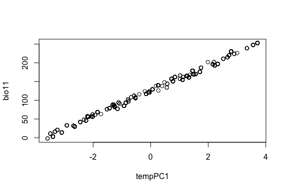

``` r
# Fairly correlated w/ bio5, bio6
 
## -------

# Precipitation PCA using BioClim vars 12-19
precipPCA <- rasterPCA(subset(peru_chile, 12:19), spca = TRUE)
summary(precipPCA$model) #PC1 has 79.8% of variation and 89.1% of variation w/ PC1+PC2
```

    Importance of components:
                              Comp.1     Comp.2     Comp.3     Comp.4      Comp.5
    Standard deviation     2.5270132 0.86326115 0.69998756 0.59199630 0.129101903
    Proportion of Variance 0.7982245 0.09315248 0.06124782 0.04380745 0.002083413
    Cumulative Proportion  0.7982245 0.89137694 0.95262476 0.99643221 0.998515624
                                 Comp.6       Comp.7       Comp.8
    Standard deviation     0.0842948678 0.0543434555 0.0426165338
    Proportion of Variance 0.0008882031 0.0003691514 0.0002270211
    Cumulative Proportion  0.9994038275 0.9997729789 1.0000000000

``` r
precipPCA$model$loadings #
```


    Loadings:
            Comp.1 Comp.2 Comp.3 Comp.4 Comp.5 Comp.6 Comp.7 Comp.8
    layer.1  0.393                       0.208  0.826  0.148  0.295
    layer.2  0.362  0.414        -0.295  0.264 -0.437  0.565  0.168
    layer.3  0.369 -0.268         0.464  0.297 -0.345 -0.352  0.496
    layer.4 -0.274  0.686 -0.278  0.611                            
    layer.5  0.366  0.384        -0.296  0.210        -0.660 -0.387
    layer.6  0.372 -0.248         0.448  0.142         0.314 -0.694
    layer.7  0.348  0.243  0.583  0.176 -0.664                     
    layer.8  0.332        -0.760        -0.542                     

                   Comp.1 Comp.2 Comp.3 Comp.4 Comp.5 Comp.6 Comp.7 Comp.8
    SS loadings     1.000  1.000  1.000  1.000  1.000  1.000  1.000  1.000
    Proportion Var  0.125  0.125  0.125  0.125  0.125  0.125  0.125  0.125
    Cumulative Var  0.125  0.250  0.375  0.500  0.625  0.750  0.875  1.000

``` r
# Add PC1 and PC2 values to dataset 
final$precipPC1 <- raster::extract(precipPCA$map$PC1, locality.coords)
final$precipPC2 <- raster::extract(precipPCA$map$PC2, locality.coords)

plot(bio12 ~ precipPC1, data=final) # Moderate correlation between PC1 and mean annual precip
```

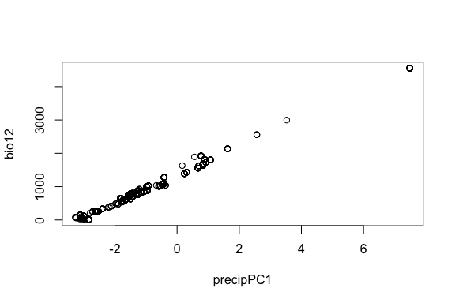

``` r
# Overal not many correlations here 
plot(bio19 ~ tempPC2, data=final) 
```

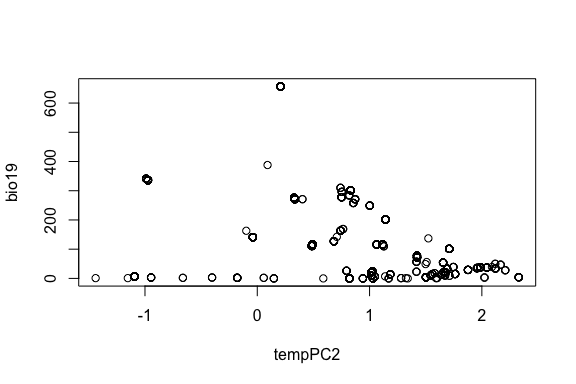

``` r
# Write out PCA rasters for later map generation:
# writeRaster(tempPCA$map$PC1, "tempPC1.grd", overwrite=TRUE)
# writeRaster(tempPCA$map$PC2, "tempPC2.grd", overwrite=TRUE)
# writeRaster(precipPCA$map$PC1, "precipPC1.grd", overwrite=TRUE)
# writeRaster(precipPCA$map$PC2, "precipPC2.grd", overwrite=TRUE)


# Look at distributions of BioClim variables 
# This and other prelim qqPlots indicated some PC variables being off at tails; see HumBlood_Modeling.Rmd for transformations
# p <- ggpairs(subset(final, select = c(elev, elev_position, mass, hb, hct, trbc, mcv, mch, mchc, tempPC1, tempPC2, precipPC1, precipPC2))) 
# print(p)
```

WORLDCLIM CODEBOOK


    They are coded as follows:

    BIO1 = Annual Mean Temperature
    BIO2 = Mean Diurnal Range (Mean of monthly (max temp - min temp))
    BIO3 = Isothermality (BIO2/BIO7) (* 100)
    BIO4 = Temperature Seasonality (standard deviation *100)
    BIO5 = Max Temperature of Warmest Month
    BIO6 = Min Temperature of Coldest Month
    BIO7 = Temperature Annual Range (BIO5-BIO6)
    BIO8 = Mean Temperature of Wettest Quarter
    BIO9 = Mean Temperature of Driest Quarter (*transformed)
    BIO10 = Mean Temperature of Warmest Quarter
    BIO11 = Mean Temperature of Coldest Quarter
    BIO12 = Annual Precipitation
    BIO13 = Precipitation of Wettest Month
    BIO14 = Precipitation of Driest Month (*transformed)
    BIO15 = Precipitation Seasonality (Coefficient of Variation)
    BIO16 = Precipitation of Wettest Quarter
    BIO17 = Precipitation of Driest Quarter (*transformed)
    BIO18 = Precipitation of Warmest Quarter
    BIO19 = Precipitation of Coldest Quarter

SAMPLING LOCALITY MAP
=====================

Mapping tips here:
<a href="https://www.r-spatial.org/r/2018/10/25/ggplot2-sf.html" class="uri">https://www.r-spatial.org/r/2018/10/25/ggplot2-sf.html</a>

``` r
library(viridis)
library(RColorBrewer)

# CROP MAP EXTENT FOR BETTER VISUALIZATION 
# Wide version: 
# xmin = -90
# xmax = 41.7
# y min = -45.3
# y max = 0.8

# Zoomed version: 
# xmin = -86
# xmax = 47.4
# y min = -37
# y max = 0.8

# crop raster and country lines to a smaller box (hard to get right, requires a lot of tinkering)
# south_america_elevs_cropped = all elevation rasters combined 
# southamerica_cropped = all country polygons combined 
# These are perfect but fairly zoomed out to capture more of southern Chile 
#ex <- extent(c(-90, -41.7, -45.3, 0.8)) # These go: xmin (left), xmax (right), ymin (bottom), ymax (top)
# Zoomed in version: 
ex <- extent(c(-86, -47.4, -37, 0.8)) # These go: xmin (left), xmax (right), ymin (bottom), ymax (top)
south_america_elevs_cropped <- crop(south_america_elevs, ex)
extent(south_america_elevs_cropped)
```

    class      : Extent 
    xmin       : -86 
    xmax       : -47.4 
    ymin       : -37 
    ymax       : 0.8 

``` r
southamerica_cropped <- crop(southamerica_countries, ex)

# FINAL MAP
# Peru and Chile sampling localities w/ rest of South America 
pdf("/Users/Jessie/Dropbox (MSBbirds)/Rdirectory/ComparativeHummingbirdBlood/Peru_and_Chile_SamplingMap_WithSouthAmerica_Cropped_Outlines.pdf", useDingbats = F)
#plot(south_america_elevs_cropped, col = colorRampPalette(c("grey20","grey80"))(100), cex.axis=1.5, ext=ex)
plot(south_america_elevs_cropped, col=magma(200), cex.axis=1.5, ext=ex)
plot(manycountries, add=TRUE, border = "gray92", lwd = 0.05) # outlines surrounding countries; must be first to "layer"
#plot(manycountries, add=TRUE, border = "gray28", lwd = 0.5) # outlines surrounding countries; must be first to "layer"
plot(peru, add=TRUE, border = "white", lwd = 1.5) # This outlines Peru 
plot(chile, add=TRUE, border = "white", lwd = 1.5) # This outlines Peru 
#plot(locality.coords, add=TRUE, pch=19, cex=0.8, col="olivedrab1") # olivedrab1 points w/ no outline # doesn't look great
plot(locality.coords, add=TRUE, pch=21, cex=1.1, bg="olivedrab1") # pch=21 is circle w/ black outline
# olivedrab1 is electric and amazing; olivedrab2 *slightly* subtler and nice, but doesn't 'pop' quite as much
# olivedrab3 looks fantastic; yellow looks nice
addscalebar(plotepsg = 4326, widthhint=0.20, labelpadin = 0.08, label.cex = 0.8, label.col = "black", pos = "bottomleft")
#with(CommunitySpatial, text(CommunitySpatial,
#  labels=CommunitySpatial$ID, pos=4, cex=1.3))
dev.off()
```

    quartz_off_screen 
                    2 

``` r
# Played around a lot with aesthetics, namely: w/out country outlines, it's a little hard to orient in South America. 
# EBL thinks 2 colors to denote country lines is a little distracting
# I sorta like thin gray28 spiderweb lines for surrounding countries and thick white lines for Peru and Chile
# I also played around with ALL white outlines but thick for Peru and Chile and super thin for surrounding countries
# I think the best approach might be THICK white Peru + Chile outlines w/ slightly dulled bright gray spiderwebs
# that are much thinner; this makes it look like all the same color, but spiderwebs won't 'pop' as much to distract

# Notes on elevation color palettes, ranked: 
# magma is stunning, sophisticated
# cividis is stunning and lovely; equivalent topography resolution to inferno but subtler palette and nice 
# inferno looks great as well but doesn't pick up as much subtlety in topography as magma 
# Viridis is stunning but is what Sabrina used for Peru malaria paper; magma also picks up more detail in topography
# plasma is ok but looks a little 'cheaper' than magma, which is very sophisticated
# terrain.colors: base R option, looks cheap
# topo.colors: actually painful for the eyes 

# See allhum_blood_comp_CUT.Rmd for other map versions that I cut/didn't include here 
```

IMPUTE MISSING VALUES? = NO!
============================

If we don’t eliminate NAs or impute missing values, brms won’t give
proper estimates

``` r
# Notes on imputation: 
# Don't impute categorical variables
# Don’t transform skewed variables: when you transform a variable to meet normality assumptions before imputing, you
    # change the distribution of that variable AND the relationship between that variable and the others you use to impute.
    # Doing so can lead to imputing outliers, creating more bias than just imputing the skewed variable
# The more imputations, the more robust the estimates. Bodner (2008) recommends as many imputations as % missing data.
    # Since our data is 57% complete, I'd hypothetically run 50 imputations (43% incomplete + buffer)

# HYPOTHETICALLY: 
#library(mice)
#imp <- mice(final, m=5, print=TRUE, maxit=5, method="cart", seed=500) # m= # imputations; maxit= # iterations/datasets
# In order to get this to work, specify method='cart' for 'classification and regression trees'
# High number of unbalanced factors in the data mean default linear regression methods won't work 
# method=cart means 'mice' won't do X matrix inversion and imputation will work 
# mice() returns a list that you can pass directly into brms with:  
# fit_imp1 <- brm_multiple(bmi ~ age*chl, data = imp, chains = 2)

# BUT, AS A GENERAL RULE, DON'T IMPUTE DATA IF YOU HAVE >5% MISSING VALUES!
percent.missing <- function(x){sum(is.na(x))/length(x)*100} # Function to calculate % missing values 
apply(final, 2, percent.missing)
```

          species         rowID            nk    msb_cat_no      prep_num 
         0.000000      0.000000      0.000000      9.847878      2.642114 
        cat_owner           sex           age         month          year 
         0.000000      0.000000      0.000000      0.000000      0.000000 
         locality          elev    department           lat           lon 
         0.000000      0.000000      0.000000      0.000000      0.000000 
             mass            hb           hct          trbc           mcv 
         1.521217     13.130504      8.887110     36.829464     38.110488 
             mchc           mch          wing             n            wa 
        21.857486     40.432346     89.191353      5.924740      5.924740 
               wm            wl      elev_min      elev_max    elev_midpt 
         5.924740      5.924740      0.000000      0.000000      0.000000 
            Clade    elev_range   range_class     po2_class elev_position 
         0.000000      0.000000      0.000000      0.000000      0.000000 
             bio1          bio2          bio3          bio4          bio5 
         0.000000      0.000000      0.000000      0.000000      0.000000 
             bio6          bio7          bio8          bio9         bio10 
         0.000000      0.000000      0.000000      0.000000      0.000000 
            bio11         bio12         bio13         bio14         bio15 
         0.000000      0.000000      0.000000      0.000000      0.000000 
            bio16         bio17         bio18         bio19       tempPC1 
         0.000000      0.000000      0.000000      0.000000      0.000000 
          tempPC2     precipPC1     precipPC2 
         0.000000      0.000000      0.000000 

``` r
# apply(final.sub, 1, percent.missing)

# We have a lot of missing blood data! Percent missing data: 
# mass = 1.52% (this would be ok for imputation)
# hb: 13.3% 
# hct 8.88%
# mcv: 38%
# mchc: 21.8%
# mch: 40.4%

# We have too much missing data to be able to impute well. 
# It's clunkier, but probably more reliable to create subsets for each blood parameter model set, then remove NAs from those

# SECOND BUT: Chris suggested we can 'impute' mass values by substituting means across species and sex
# Start with a summary of species means for each sex 
library(dplyr)
species.mass.summary <- final %>% group_by(species, sex) %>%
                                  dplyr::summarize(mean_mass = mean(mass, na.rm = TRUE), 
                                  count =n())
species.mass.summary
```

    # A tibble: 143 x 4
    # Groups:   species [77]
       species                 sex     mean_mass count
       <fct>                   <fct>       <dbl> <int>
     1 Adelomyia melanogenys   female       3.48    21
     2 Adelomyia melanogenys   male         4.03    25
     3 Adelomyia melanogenys   unknown      4.01     1
     4 Aglaeactis castelnaudii female       6.57    13
     5 Aglaeactis castelnaudii male         6.19     3
     6 Aglaeactis cupripennis  female       6.91    12
     7 Aglaeactis cupripennis  male         7.17     5
     8 Aglaiocercus kingii     female       4.47    10
     9 Aglaiocercus kingii     male         4.98    11
    10 Amazilia amazilia       female       4.42    26
    # … with 133 more rows

``` r
# Call summarize from dplyr with dplyr::summarize or R pulls from something else 

# Create a teeny subset with all mass=NA values 
nomasses <- final[-which(!is.na(final$mass)),] # 19 observations missing masses that you'll "impute" w/ species mean values
final.nomasses <- final[-which(is.na(final$mass)),] # Drop missing mass records from final dataset 

# Now, impute missing values manually based on species mean values for each sex 
# There has *got* to be a less manual and clunky as hell way to do this...

colnames(nomasses) # col 16 is mass 
```

     [1] "species"       "rowID"         "nk"            "msb_cat_no"   
     [5] "prep_num"      "cat_owner"     "sex"           "age"          
     [9] "month"         "year"          "locality"      "elev"         
    [13] "department"    "lat"           "lon"           "mass"         
    [17] "hb"            "hct"           "trbc"          "mcv"          
    [21] "mchc"          "mch"           "wing"          "n"            
    [25] "wa"            "wm"            "wl"            "elev_min"     
    [29] "elev_max"      "elev_midpt"    "Clade"         "elev_range"   
    [33] "range_class"   "po2_class"     "elev_position" "bio1"         
    [37] "bio2"          "bio3"          "bio4"          "bio5"         
    [41] "bio6"          "bio7"          "bio8"          "bio9"         
    [45] "bio10"         "bio11"         "bio12"         "bio13"        
    [49] "bio14"         "bio15"         "bio16"         "bio17"        
    [53] "bio18"         "bio19"         "tempPC1"       "tempPC2"      
    [57] "precipPC1"     "precipPC2"    

``` r
nomasses[nomasses$species=="Aglaiocercus kingii" & nomasses$sex=="female",][, "mass"] <- 4.465556 # Mean female mass
nomasses[nomasses$species=="Amazilia chionogaster" & nomasses$sex=="female",][, "mass"] <- 5.513333
nomasses[nomasses$species=="Chrysuronia oenone" & nomasses$sex=="male",][, "mass"] <- 4.599000
nomasses[nomasses$species=="Coeligena violifer" & nomasses$sex=="male",][, "mass"] <- 7.894615
nomasses[nomasses$species=="Coeligena violifer" & nomasses$sex=="female",][, "mass"] <- 7.693182
nomasses[nomasses$species=="Colibri coruscans" & nomasses$sex=="male",][, "mass"] <- 8.466667
nomasses[nomasses$species=="Eriocnemis luciani" & nomasses$sex=="female",][, "mass"] <- 6.491429 
nomasses[nomasses$species=="Eriocnemis luciani" & nomasses$sex=="male",][, "mass"] <- 7.133333
nomasses[nomasses$species=="Florisuga mellivora" & nomasses$sex=="male",][, "mass"] <- 6.882500
nomasses[nomasses$species=="Metallura tyrianthina" & nomasses$sex=="male",][, "mass"] <- 3.784615
nomasses[nomasses$species=="Myrtis fanny" & nomasses$sex=="female",][, "mass"] <- 2.648000
nomasses[nomasses$species=="Oreotrochilus melanogaster" & nomasses$sex=="female",][, "mass"] <- 7.078448
nomasses[nomasses$species=="Patagona gigas" & nomasses$sex=="female",][, "mass"] <- 19.972381
nomasses[nomasses$species=="Pterophanes cyanopterus" & nomasses$sex=="female",][, "mass"] <- 10.465714
nomasses[nomasses$species=="Pterophanes cyanopterus" & nomasses$sex=="male",][, "mass"] <- 11.550000
nomasses[nomasses$species=="Taphrospilus hypostictus" & nomasses$sex=="female",][, "mass"] <- 7.150000

# Recombine datasets 
final <- rbind(final.nomasses, nomasses)

# Check percent missing mass with this, should now be zero 
percent.missing <- function(x){sum(is.na(x))/length(x)*100} # Function to calculate % missing values 
apply(final, 2, percent.missing)
```

          species         rowID            nk    msb_cat_no      prep_num 
         0.000000      0.000000      0.000000      9.847878      2.642114 
        cat_owner           sex           age         month          year 
         0.000000      0.000000      0.000000      0.000000      0.000000 
         locality          elev    department           lat           lon 
         0.000000      0.000000      0.000000      0.000000      0.000000 
             mass            hb           hct          trbc           mcv 
         0.000000     13.130504      8.887110     36.829464     38.110488 
             mchc           mch          wing             n            wa 
        21.857486     40.432346     89.191353      5.924740      5.924740 
               wm            wl      elev_min      elev_max    elev_midpt 
         5.924740      5.924740      0.000000      0.000000      0.000000 
            Clade    elev_range   range_class     po2_class elev_position 
         0.000000      0.000000      0.000000      0.000000      0.000000 
             bio1          bio2          bio3          bio4          bio5 
         0.000000      0.000000      0.000000      0.000000      0.000000 
             bio6          bio7          bio8          bio9         bio10 
         0.000000      0.000000      0.000000      0.000000      0.000000 
            bio11         bio12         bio13         bio14         bio15 
         0.000000      0.000000      0.000000      0.000000      0.000000 
            bio16         bio17         bio18         bio19       tempPC1 
         0.000000      0.000000      0.000000      0.000000      0.000000 
          tempPC2     precipPC1     precipPC2 
         0.000000      0.000000      0.000000 

``` r
# yay! No missing mass data. 

# Final dataset without Hb genotypes:
write.csv(final, "/Users/Jessie/Dropbox (MSBbirds)/Rdirectory/ComparativeHummingbirdBlood/AllHummingbirdBlood_Wrangled_withBioClim_andPCA_NoHbGenotypes_11-09-20.csv")
```

Vignette on handling missing values w/ brms:
<a href="https://cran.r-project.org/web/packages/brms/vignettes/brms_missings.html" class="uri">https://cran.r-project.org/web/packages/brms/vignettes/brms_missings.html</a>

Another imputation tutorial:
<a href="https://stefvanbuuren.name/fimd/sec-toomany.html" class="uri">https://stefvanbuuren.name/fimd/sec-toomany.html</a>

More important imputation stuff:
<a href="https://www.theanalysisfactor.com/multiple-imputation-5-recent-findings-that-change-how-to-use-it/" class="uri">https://www.theanalysisfactor.com/multiple-imputation-5-recent-findings-that-change-how-to-use-it/</a>

Imputation help:
<a href="https://www.kaggle.com/c/house-prices-advanced-regression-techniques/discussion/24586" class="uri">https://www.kaggle.com/c/house-prices-advanced-regression-techniques/discussion/24586</a>

ADD IN HEMOGLOBIN GENOTYPES
===========================

``` r
# Instantiate new columns 
final$b13 <- NA
final$b83 <- NA 

# Add in beta13 position amino acids 

# SER at beta 13
final$b13[final$species=="Patagona gigas" | 
          final$species=="Chalcostigma stanleyi" | 
          final$species=="Oreotrochilus melanogaster" | 
          final$species=="Oreotrochilus estella" | 
          final$species=="Oreotrochilus leucopleurus"] <- paste("Ser")

# SER at beta 83
final$b83[final$species=="Patagona gigas" | 
          final$species=="Chalcostigma stanleyi" | 
          final$species=="Oreotrochilus melanogaster" | 
          final$species=="Oreotrochilus estella" | 
          final$species=="Oreotrochilus leucopleurus"] <- paste("Ser")

# GLY at beta 13
final$b13[final$species=="Amazilia viridicauda" | 
          final$species=="Amazilia chionogaster" | 
          final$species=="Amazilia lactea" | 
          final$species=="Amazilia amazilia" | 
          final$species=="Chrysuronia oenone" | 
          final$species=="Taphrospilus hypostictus" | 
          final$species=="Thalurania furcata" | 
          final$species=="Thaumastura cora" | 
          final$species=="Calliphlox amethystina" |
          final$species=="Metallura tyrianthina" | 
          final$species=="Metallura phoebe" |
          final$species=="Chalcostigma ruficeps" | 
          final$species=="Chalcostigma herrani" | 
          final$species=="Polyonymus caroli" | 
          final$species=="Aglaiocercus kingii" | 
          final$species=="Adelomyia melanogenys" |
          final$species=="Heliangelus micraster" |
          final$species=="Heliangelus viola" |
          final$species=="Heliangelus amethysticollis" |
          final$species=="Phlogophilus harterti" |
          final$species=="Coeligena lutetiae" |
          final$species=="Coeligena iris" |
          final$species=="Coeligena violifer" |
          final$species=="Coeligena torquata" |
          final$species=="Coeligena coeligena" |
          final$species=="Heliodoxa leadbeateri" |
          final$species=="Heliodoxa rubinoides" |
          final$species=="Ocreatus underwoodii" |
          final$species=="Boissonneaua matthewsii" |
          final$species=="Pterophanes cyanopterus" |
          final$species=="Ensifera ensifera" |
          final$species=="Aglaeactis castelnaudii" |
          final$species=="Lafresnaya lafresnayi" |
          final$species=="Eriocnemis luciani" |
          final$species=="Eriocnemis aline" |
          final$species=="Haplophaedia aureliae" |
          final$species=="Anthracothorax nigricollis" |
          final$species=="Colibri coruscans" |
          final$species=="Schistes geoffroyi" |
          final$species=="Doryfera ludovicae" |
          final$species=="Phaethornis ruber" |
          final$species=="Phaethornis hispidus" |
          final$species=="Phaethornis malaris" |
          final$species=="Phaethornis guy" |
          final$species=="Phaethornis syrmatophorus" |
          final$species=="Glaucis hirsutus" |
          final$species=="Threnetes leucurus" |
          final$species=="Eutoxeres condamini" | 
          final$species=="Florisuga mellivora" |  # Everything below F. mellivora was added w/ Chris data or inference 
          final$species=="Amazilia franciae" | 
          final$species=="Campylopterus villaviscensio" | 
          final$species=="Eutoxeres aquila" | 
          final$species=="Klais guimeti" | 
          final$species=="Leucippus taczanowskii" | 
          final$species=="Myrmia micrura" | 
          final$species=="Phaethornis atrimentalis" | 
          final$species=="Sephanoides sephaniodes" | 
          final$species=="Campylopterus largipennis" | 
          final$species=="Heliodoxa aurescens" | 
          final$species=="Heliomaster longirostris" | 
          final$species=="Phaethornis philippii" | 
          final$species=="Phaethornis stuarti" | 
          final$species=="Chaetocercus mulsant" | 
          final$species=="Eriocnemis vestita" | 
          final$species=="Myrtis fanny" |
          final$species=="Aglaeactis cupripennis" |
          final$species=="Colibri cyanotus" |
          final$species=="Lesbia nuna" |
          final$species=="Lesbia victoriae" |
          final$species=="Metallura eupogon" |
          final$species=="Oreonympha nobilis" |
          final$species=="Rhodopis vesper" ] <- paste("Gly")

# GLY at beta 83 (black tips in Projecto-Garcia tree)
final$b83[final$species=="Amazilia lactea" | 
          final$species=="Amazilia amazilia" | 
          final$species=="Chrysuronia oenone" | 
          final$species=="Taphrospilus hypostictus" | 
          final$species=="Calliphlox amethystina" |
          final$species=="Aglaiocercus kingii" | 
          final$species=="Adelomyia melanogenys" |
          final$species=="Heliangelus micraster" |
          final$species=="Heliangelus viola" |
          final$species=="Heliangelus amethysticollis" |
          final$species=="Phlogophilus harterti" |
          final$species=="Coeligena torquata" |
          final$species=="Coeligena coeligena" |
          final$species=="Heliodoxa leadbeateri" |
          final$species=="Heliodoxa rubinoides" |
          final$species=="Haplophaedia aureliae" |
          final$species=="Anthracothorax nigricollis" |
          final$species=="Schistes geoffroyi" |
          final$species=="Phaethornis ruber" |
          final$species=="Phaethornis hispidus" |
          final$species=="Phaethornis malaris" |
          final$species=="Phaethornis guy" |
          final$species=="Phaethornis syrmatophorus" |
          final$species=="Glaucis hirsutus" |
          final$species=="Threnetes leucurus" |
          final$species=="Eutoxeres condamini" | 
          final$species=="Florisuga mellivora" |  # Everything below F. mellivora added w/ Chris data or inference 
          final$species=="Amazilia franciae" |
          final$species=="Campylopterus villaviscensio" |
          final$species=="Eutoxeres aquila" |
          final$species=="Klais guimeti" |
          final$species=="Leucippus taczanowskii" |
          final$species=="Myrmia micrura" |
          final$species=="Phaethornis atrimentalis" |
          final$species=="Sephanoides sephaniodes" |
          final$species=="Campylopterus largipennis" |
          final$species=="Heliodoxa aurescens" |
          final$species=="Heliomaster longirostris" |
          final$species=="Phaethornis philippii" |
          final$species=="Phaethornis stuarti" ] <- paste("Gly")

# SER at beta 83 (gray tips in Projecto-Garcia tree)
final$b83[final$species=="Amazilia viridicauda" | 
          final$species=="Amazilia chionogaster" | 
          final$species=="Thalurania furcata" |
          final$species=="Thaumastura cora" |
          final$species=="Metallura tyrianthina" |
          final$species=="Metallura phoebe" |
          final$species=="Chalcostigma ruficeps" |
          final$species=="Chalcostigma herrani" |
          final$species=="Polyonymus caroli" |
          final$species=="Coeligena lutetiae" |
          final$species=="Coeligena iris" |
          final$species=="Coeligena violifer" |
          final$species=="Ocreatus underwoodii" |
          final$species=="Boissonneaua matthewsii" |
          final$species=="Pterophanes cyanopterus" |
          final$species=="Ensifera ensifera" |
          final$species=="Aglaeactis castelnaudii" |
          final$species=="Lafresnaya lafresnayi" |
          final$species=="Eriocnemis luciani" |
          final$species=="Eriocnemis aline" |
          final$species=="Colibri coruscans" |
          final$species=="Doryfera ludovicae" |  # Everything below D. ludoviciae added w/ Chris data or inference 
          final$species=="Chaetocercus mulsant" | 
          final$species=="Eriocnemis vestita" | 
          final$species=="Myrtis fanny" | 
          final$species=="Aglaeactis cupripennis" | 
          final$species=="Colibri cyanotus" | 
          final$species=="Lesbia nuna" | 
          final$species=="Lesbia victoriae" | 
          final$species=="Metallura eupogon" | 
          final$species=="Oreonympha nobilis" | 
          final$species=="Rhodopis vesper" ] <- paste("Ser")

# Combine b13 and b83 to make a b13-b83 genotype: 
final$b13b83.genotype <- paste(final$b13, final$b83,sep="-") # specify dash separator; can change this 

# Hb genotype summary 
# Summarize by clade 
genotype.summary <- final %>% group_by(b13b83.genotype) %>% summarise(count = length(species)); genotype.summary
```

    # A tibble: 3 x 2
      b13b83.genotype count
      <chr>           <int>
    1 Gly-Gly           490
    2 Gly-Ser           529
    3 Ser-Ser           230

How we did this: We first added Hb genotypes from Projecto-Garcia et
al. 2013. If any were missing, Jessie looked through old Hbba sequence
files from Chris, assembled alignments with 5 GenBank Reference
sequences from Projecto-Garcia, and determined Hb genotypes that way
(see description of this workflow in
Hbba-genotyping-workflow-hummingbird-comparative-data\_08-27-20.doc).
Then, if species were still missing, Jessie took Hb genotypes from the
McGuire et al .nex file that Chris sent over that has a nice little
alignment of b13-b83 genotypes for many species.

After doing this, we were still left with 15 species missing Hb
genotypes. We made educated best guesses based on genotypes of sister
taxa and elevational ranges. We think most of these are
solidly-inferred, though we know this is not a foolproof method.
Rationale for best guesses is provided in:
ComparativeHummingbirdData\_SpeciesMissingHbGenotypes\_Data&BestGuesses\_08-28-20.xlsx

Here are the list of 15 species for which we used “best guess” Hb
genotype info: Amazilia franciae Campylopterus villaviscensio Eutoxeres
aquila Klais guimeti Leucippus taczanowskii Myrmia micrura Phaethornis
atrimentalis Sephanoides sephaniodes Chaetocercus mulsant Eriocnemis
vestita Myrtis fanny Oreotrochilus leucopleurus

For elevational range phylogeny figure: Ceate a species mean dataset, wrangle into workable format for Illustrator figure
=========================================================================================================================

Note: this script should be cleaned up and probably moved for my plots &
figs .Rmd. Still a working chunk, in here for now.
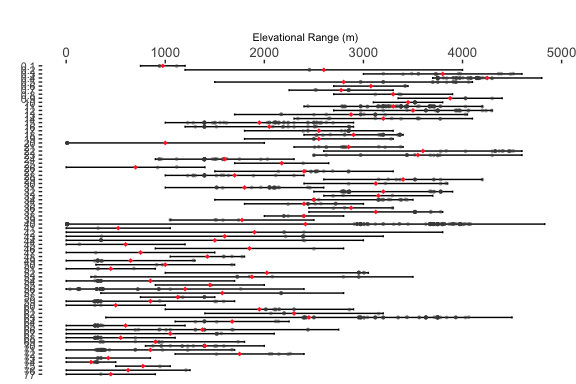

Helpful data summarizing tips:
<a href="http://kbroman.org/datacarpentry_R_2016-06-01/03-dplyr.html" class="uri">http://kbroman.org/datacarpentry_R_2016-06-01/03-dplyr.html</a>

READ OUT FINAL DATASETS FOR DOWNSTREAM ANALYSES:
================================================

Since Patagona is a huge body size outlier, make a non-Patagona subset
to be able to do some body size comparisons below

``` r
# FINAL FINAL: This is the 'final' dataset w/ PCA reduced-BioClimVars
write.csv(final, "/Users/Jessie/Dropbox (MSBbirds)/Rdirectory/ComparativeHummingbirdBlood/AllHummingbirdBlood_Wrangled_withBioClim_andPCA_11-09-20.csv")

# Patagona-free subset (for possible modeling of mass, where Patagona is a huge body size outlier):
final.nopgig <- final[-which(final$species == "Patagona gigas"),] # 161 Patagona observations 
write.csv(final.nopgig, "/Users/Jessie/Dropbox (MSBbirds)/Rdirectory/ComparativeHummingbirdBlood/HumBlood.final.nopgig_11-09-20.csv")
```

Print environment for reproducibility
=====================================

########### 

END
---
